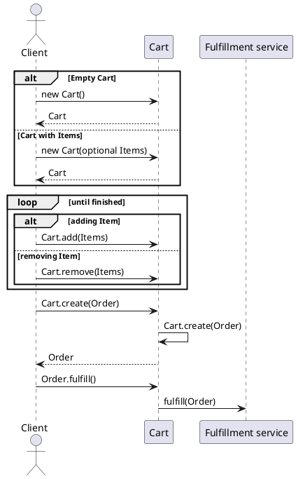

## Building the library for non-Maven clients

### Uber jar
You can generate an uber jar containing `cart-service-v1-lib` with only service platform dependencies (cart-service, product-catalog-service, pricing-service, payment-service, documents-service) or a full uber jar which also adds 3rd party dependencies (jackson, swagger).

Uber jar with only service platform dependencies:
```
cd v1/lib
mvn clean package -P sp
```
Resulting jar can be found in `target/cart-service-v1-lib-2.6.5-custom-jar-with-dependencies.jar`.

Full uber jar:
```
cd v1/lib
mvn clean package -P full 
```
Resulting jar can be found in `target/cart-service-v1-lib-2.6.5-jar-with-dependencies.jar`

If you are using Maven for dependency management you can also install and use the uber jar as an artifact:
```
mvn install:install-file -Dfile=cart-service-v1-lib-2.6.6-custom-jar-with-dependencies.jar -DgroupId=com.kumuluz.digital.cart -DartifactId=cart-service-v1-lib -Dversion=2.6.66 -Dpackaging=jar
```

### Swagger Codegen
You can generate a java lib from Swagger schema using `swagger-codegen`.

First create a config file `config.json` for codegen:
```
{
    "modelPackage" : "com.kumuluz.digital.cart.lib.v1",
    "apiPackage": "com.kumuluz.digital.cart.client",
    "groupId": "com.kumuluz.digital.cart",
    "artifactId": "cart-service-lib",
    "artifactVersion": "2.4.0-SNAPSHOT",
    "hideGenerationTimestamp": true,
    "dateLibrary": "java8",
    "library": "jersey2"
}
```
Run codegen:
```
java -jar swagger-codegen-cli.jar generate -i http://pws-test.petrol.si/cart_fresh/api-specs/v1/swagger.json -l java -c ./config.json -o generated-sources --type-mappings OffsetDateTime=java.time.Instant
```

You can also use a [wrapper script](https://github285.petrol.si/digital-services/codegen-utils) which removes the generated client and unwanted dependencies, leaving POJO lib and Jackson annotations only.

> [!COMMENT]
> Differences from uber jar:
> 1. Losing the original package information. All classes are placed in a single package.
> 2. Enums are inlined instead of separate files.
> 3. There is no configuration option to generate a POJO lib only, we need to remove unwated generated client code and dependencies manually or via wrapper script.

## Important configuration options

Values specified below are the default and will be used if property is not defined.

```
PETROL-API_CART-DURATION-IN-SECONDS=3600
```
Seconds before new cart expires.

```
PETROL-API_VALIDATE-LOCATIONS=true
```
Whether to validate location IDs passed in when creating new cart.

```
PETROL-API_VALIDATE-SALES-CHANNELS=true
```
Whether to validate sales channel IDs passed in when creating new cart.

```
PETROL-API_OVERRIDE-PREP-TIME-IF-MISSING=false
```
If preparation type is missing in PC, mock it (it is set to 5 minutes).

```
PETROL-API_MOCK-CUSTOMER-ID=false
```
Only use for testing. Sets customer id to 30005 if not found.

```
PETROL-API_PRODUCT-CATALOG-MAJOR-VERSION=1
```
This value is set to PC variation snapshot to identify the upstream PC API version for future backwards compatibility.

```
PETROL-API_CART-PREVIEW-DURATION-IN-SECONDS=900
```
Max time in seconds before price check expires (call to /updatePrices).

```
PETROL-API_STOCK-DEFAULT-COMPANY-ID=9110
```
Which company ID to use when querying stock service. Only Petrol company products are currently in use so this is a static setting.

```
PETROL-API_IGNORE-INVALID-PRICINGS=false
```
Only use in testing. If pricing is not defined, mock it with value of 1 EUR. If disabled, exception is thrown instead.

```
PETROL-API_DEBUG-JAXRS-CLIENT=false
```
Log full integration reuqests including HTTP body and headers.

```
PETROL-API_USE-MOCK-PRODUCT-CATALOGUE=false
```
Use internal mocked PC. Only used in legacy deployment.

## Usage

Typical use case scenario of `cart-service` consists of:

1. Creating a new empty cart or a new cart with items  
2. Add items  
3. Remove items  
4. Add and remove modifiers  
5. Add and remove user defined attributes  
6. Create order  
7. Fulfill order  





Items being added to cart must be present in Product Catalog (`product-service`).

Some examples of usage can be found in Postman integration tests residing in `postman-test-collection` folder.

### The API

The API in test environment is available at `https://apit.petrol.si/cart_fresh/v1/`.

All API calls are protected with Mashery `api_key` which needs to be supplied as a query parameter `?api_key=gqxd8w4e7j8md3w7mazk9z3u`.

All API Errors are defined in `README_API_ERRORS.md`, only references are used in this document.

### API dependencies


### Create an empty cart

*POST {{baseUrl}}/v1/carts*

Body:
```json
{
  "channel": {
    "id": "{{channelAppFresh}}"
  },
  "location": {
    "id": "{{locationId}}"
  }
}
```

Channel and location are the only mandatory attributes when creating an empty cart. Locations can be found in product-service, for example by calling `GET {{productBaseUrl}}/v1/locations?api_key={{productApiKey}}&where=externalId:EQ:2311`. The specified location is the target, where the pickup happens and invoice is generated.

Channel ID can also be found in product service, for example: `GET {{productBaseUrl}}/v1/channels?api_key={{productApiKey}}&where=handle:LIKE:fresh%`.

Response example:

```json
{
    "id": "d9fa6136-9d80-4230-9986-22ba01eb542f",
    "createdAt": "2018-09-17T15:30:30.322Z",
    "updatedAt": "2018-09-17T15:30:30.322Z",
    "authId": "f0c36497-01db-4283-93b8-3c0a07964436",
    "status": "OPEN",
    "currency": "EUR",
    "amount": 0,
    "discountAmount": 0,
    "taxAmount": 0,
    "amountExTax": 0,
    "expiresAt": "2018-09-18T15:30:30.264Z",
    "channel": {
        "id": "cf68586d-8019-4462-8bc6-d77378484e13"
    },
    "location": {
        "id": "70d1a85e-90c2-4ea0-be3a-9a24294e15ab"
    },
    "items": [],
    "payments": [],
    "discounts": [],
    "uniqueDocuments": [],
    "pricingPropertiesAggregate": [],
    "type": "STANDARD"
}
```

#### Possible errors:
- 404 for invalid location or channel

### Cart location (target location)
`location` attribute specifies the location which is used for validating stock, price and benefits.

### Source location and source sublocations

You can optionally specify source location which is the location where the cart is being constructed. You can further specify in more detail where at the source location the cart is being created or on which device/system with `sourceSubLocation` attribute.

```
"location": {
    "id": "{{locationIdCelovska}}"
},
"sourceLocation": {
    "id": "{{locationIdCelovska}}"
},
"sourceSubLocation": {
    "id": "{{fdId}}",
    "type": "FUEL_DISPENSER"
}
```
This example means: cart is being created on a terminal at `fdId` dispenser on location `sourceLocation`. Target location is same as source in this example but it does not have to be. If `sourceSubLocation`is specified, `sourceLocation` is mandatory.

The only supported sublocation type right now is `FUEL_DISPENSER`.

### Create a cart with initial items

You can also create a new cart with items in a single call.

*POST {{baseUrl}}/v1/carts*

Body:
```json
{
  "items": [
    {
      "quantity": 1,
      "productVariation": {
         "sku": "{{skuHamburger}}",
         "variationProductType": "PHYSICAL"
      }
    }
  ],
  "channel": {
    "id": "{{channelAppFresh}}"
  },
  "location": {
    "id": "{{locationIdCelovska}}"
  }
}
```

`quantity` and `productVariation` are the only mandatory fields when adding items with **FIXED** pricing. `productVariation` must contain either the **SKU number AND variation** type or a **variation ID** retrieved from Product Catalog.

SKU is unique only in the same type category.

Example of passing with variation id:

```json
"productVariation": {
    "id": "{{hamburgerVariationId}}"
}
```

Response example:

```json
{
    "id": "49482167-7e63-4b04-ac52-89371e78dd2d",
    "createdAt": "2018-09-17T15:37:05.093Z",
    "updatedAt": "2018-09-17T15:37:05.093Z",
    "authId": "f0c36497-01db-4283-93b8-3c0a07964436",
    "status": "OPEN",
    "currency": "EUR",
    "amount": 4.39,
    "discountAmount": 0,
    "taxAmount": 0.42,
    "amountExTax": 3.97,
    "expiresAt": "2018-09-18T15:37:03.692Z",
    "channel": {
        "id": "cf68586d-8019-4462-8bc6-d77378484e13"
    },
    "location": {
        "id": "70d1a85e-90c2-4ea0-be3a-9a24294e15ab"
    },
    "items": [
        {
            "id": "6454b234-2a81-4a01-873a-31afc0e49556",
            "quantity": 1,
            "name": "Hamburger",
            "unit": "ITEM",
            "currency": "EUR",
            "basePrice": 4.39,
            "price": 4.39,
            "priceExTax": 3.97,
            "amount": 4.39,
            "discountAmount": 0,
            "discountPercent": 0,
            "taxAmount": 0.42,
            "taxPercent": 9.5,
            "amountExTax": 3.97,
            "externalId": "bb4b9331-c88e-4046-ba4b-24b0094593eb",
            "pricingScheme": "BASE_PRICING",
            "priceSubType": "73",
            "taxes": [],
            "discounts": [],
            "canBeReimbursed": true,
            "bundleSelection": [],
            "pricingProperties": [],
            "attributes": [
                {
                    "value": "Bela",
                    "productAttribute": {
                        "id": "a069f36f-b0f8-4d49-9922-01d55f4fea21",
                        "createdAt": "2018-09-17T15:37:05.093Z",
                        "updatedAt": "2018-09-17T15:37:05.093Z",
                        "name": "Na daljinsko upravljanje",
                        "key": "NA_DALJINSKO_UPRAVLJANJE",
                        "type": "STRING",
                        "externalId": "333df31b-6c12-4402-92c3-d737c6613ccc"
                    }
                },
                {
                    "value": "M",
                    "productAttribute": {
                        "id": "3f52be83-965b-4df1-ae6d-95c46c77eb9b",
                        "createdAt": "2018-09-17T15:37:05.093Z",
                        "updatedAt": "2018-09-17T15:37:05.093Z",
                        "name": "Velikost",
                        "key": "VELIKOST",
                        "type": "STRING",
                        "externalId": "5d3ec0ed-6b0a-4bf0-9333-2031b6159dfd"
                    }
                },
                {
                    "value": "Vsebuje",
                    "productAttribute": {
                        "id": "fd9de0bf-8ea3-49d4-ac4f-13f9b643ad3b",
                        "createdAt": "2018-09-17T15:37:05.093Z",
                        "updatedAt": "2018-09-17T15:37:05.093Z",
                        "name": "Gorčično seme 1",
                        "key": "ALERGEN",
                        "type": "STRING",
                        "externalId": "0788d32e-678e-4e68-80c7-7537c4a704bf"
                    }
                },
                {
                    "value": "Vsebuje",
                    "productAttribute": {
                        "id": "300a626f-a59c-4a01-a850-1baedba68d4f",
                        "createdAt": "2018-09-17T15:37:05.093Z",
                        "updatedAt": "2018-09-17T15:37:05.093Z",
                        "name": "Žita (gluten) - Pšenica",
                        "key": "ALERGEN",
                        "type": "STRING",
                        "externalId": "79a56c04-bbeb-45f2-9c5c-3cd99d3c355e"
                    }
                },
                {
                    "value": "V sledeh",
                    "productAttribute": {
                        "id": "594c37b1-0a7a-4349-94ae-06ca76e32237",
                        "createdAt": "2018-09-17T15:37:05.093Z",
                        "updatedAt": "2018-09-17T15:37:05.093Z",
                        "name": "Jajca",
                        "key": "ALERGEN",
                        "type": "STRING",
                        "externalId": "2946222e-e391-4c44-8f35-2a60e4196950"
                    }
                },
                {
                    "value": "V sledeh",
                    "productAttribute": {
                        "id": "4ad39344-b7e5-4914-aee8-bd5bee54e104",
                        "createdAt": "2018-09-17T15:37:05.093Z",
                        "updatedAt": "2018-09-17T15:37:05.093Z",
                        "name": "Soja",
                        "key": "ALERGEN",
                        "type": "STRING",
                        "externalId": "1617cb49-7f2c-47ff-829a-d8c93704e883"
                    }
                },
                {
                    "value": "Vsebuje",
                    "productAttribute": {
                        "id": "87259497-7e82-495c-b811-af289b0d74c7",
                        "createdAt": "2018-09-17T15:37:05.093Z",
                        "updatedAt": "2018-09-17T15:37:05.093Z",
                        "name": "Mleko",
                        "key": "ALERGEN",
                        "type": "STRING",
                        "externalId": "a32de19b-e75f-4611-8870-12912afb3ae6"
                    }
                },
                {
                    "value": "V sledeh",
                    "productAttribute": {
                        "id": "b83e2c1a-3bd8-4062-812c-bf0cda40e721",
                        "createdAt": "2018-09-17T15:37:05.093Z",
                        "updatedAt": "2018-09-17T15:37:05.093Z",
                        "name": "Sezam",
                        "key": "ALERGEN",
                        "type": "STRING",
                        "externalId": "0cc6ab60-ee6d-4560-99c1-e167f980c305"
                    }
                }
            ],
            "modifiers": [
                {
                    "id": "b10ff58e-5995-4a3c-86a6-29eca693aeae",
                    "createdAt": "2018-09-17T15:37:05.093Z",
                    "updatedAt": "2018-09-17T15:37:05.093Z",
                    "name": "Sestavine",
                    "type": "MULTIPLE_SELECTION",
                    "externalId": "6a5e348b-e997-4370-8836-39ec9a2dd447",
                    "values": [
                        {
                            "id": "e03a3cb0-9f4e-42aa-8d22-fe24be63f556",
                            "createdAt": "2018-09-17T15:37:05.093Z",
                            "updatedAt": "2018-09-17T15:37:05.093Z",
                            "name": "Čebula",
                            "externalId": "7bbbc62c-870e-48c2-8d25-cffbcd6be460",
                            "default": true
                        },
                        {
                            "id": "9ae95a43-0714-42ac-aeb5-0557643628ab",
                            "createdAt": "2018-09-17T15:37:05.093Z",
                            "updatedAt": "2018-09-17T15:37:05.093Z",
                            "name": "Gorčica",
                            "externalId": "9906f8ac-bf38-416a-997d-3506096aa24a",
                            "default": true
                        }
                    ]
                },
                {
                    "id": "130c994d-7995-412c-be89-78b7b2444fc6",
                    "createdAt": "2018-09-17T15:37:05.093Z",
                    "updatedAt": "2018-09-17T15:37:05.093Z",
                    "name": "Opcijski dodatki",
                    "type": "SINGLE_SELECTION",
                    "externalId": "27711875-83f1-490a-af18-c3d0c4461343",
                    "values": [
                        {
                            "id": "b443a1be-2a05-457c-abe4-916250df0aab",
                            "createdAt": "2018-09-17T15:37:05.093Z",
                            "updatedAt": "2018-09-17T15:37:05.093Z",
                            "name": "Paradižnik",
                            "externalId": "7fb94023-f5c2-4309-aab4-60210428f775",
                            "default": true
                        }
                    ]
                }
            ],
            "productVariation": {
                "id": "bb4b9331-c88e-4046-ba4b-24b0094593eb",
                "productId": "21355e7f-2dd4-445d-b1c1-b85ed910db52",
                "sku": "138534",
                "variationProductType": "PHYSICAL",
                "service": {
                    "id": "aa8bf35a-5a41-484e-acc7-ea4e9826f033",
                    "pickupThreshold": 180
                },
                "preparationTimeInSeconds": 300
            },
            "documents": [],
            "orderReadiness": "READY",
            "linkedItems": [],
            "relatedItems": [],
            "characteristics": [
                {
                    "id": "8a140d98-9d1f-4c0f-948d-91e9706a6bfb",
                    "createdAt": "2018-09-17T15:37:05.093Z",
                    "updatedAt": "2018-09-17T15:37:05.093Z",
                    "externalId": "96749137-3eeb-4ed0-b36c-929013385d2f",
                    "key": "MAKSIMALNI_CAS_NAROCANJA",
                    "valueType": "DECIMAL",
                    "externalValueId": "a96215cc-30da-4ac6-9bff-293277427dc5",
                    "value": "97200",
                    "validFrom": "1971-12-31T23:00:00Z",
                    "validTo": "9999-12-30T23:00:00Z"
                },
                {
                    "id": "d36db78d-1c39-4bb8-b00d-9a559a43a447",
                    "createdAt": "2018-09-17T15:37:05.093Z",
                    "updatedAt": "2018-09-17T15:37:05.093Z",
                    "externalId": "08d8f051-2503-462c-a1cc-8cc5a9053994",
                    "key": "MINIMALNI_CAS_NAROCANJA",
                    "valueType": "DECIMAL",
                    "externalValueId": "cdec3b63-4d7d-4179-8212-3e62329ddcc1",
                    "value": "1800",
                    "validFrom": "1971-12-31T23:00:00Z",
                    "validTo": "9999-12-30T23:00:00Z"
                }
            ]
        }
    ],
    "payments": [],
    "discounts": [],
    "uniqueDocuments": [],
    "pricingPropertiesAggregate": [],
    "type": "STANDARD"
}
```

#### Getting products and variations from product catalog

**Get pizza product**  
*GET {{productBaseUrl}}/v1/products?api_key={{productApiKey}}&where=externalId:EQ:201184*

**Get all pizza variations**  
*GET {{productBaseUrl}}/v1/products/{{productIdPizza}}/variations?api_key={{productApiKey}}*

**Get Hamburger product**  
*GET {{productBaseUrl}}/v1/products?api_key={{productApiKey}}&where=shortName:EQ:HAMBURGER*

Response example: 
```json
[
    {
        "id": "464e41ac-7c02-4618-9efb-f32198ca0c98",
        "createdAt": "2018-03-27T12:44:29.358339Z",
        "updatedAt": "2018-03-29T07:44:51.566Z",
        "externalId": "5901340",
        "shortName": "HAMBURGER",
        "longName": "HAMBURGER",
        "shortDescription": "HAMBURGER",
        "longDescription": "HAMBURGER",
        "handle": "hamburger",
        "unit": "ITEM",
        "pricingType": "FIXED",
        "type": "PHYSICAL",
        "availability": "AVAILABLE",
        "fulfillmentType": "MANUAL",
        "variations": [
            {
                "id": "b199f902-8144-4a9a-9588-da077d016afd",
                "createdAt": "2018-03-19T09:04:21.989869Z",
                "updatedAt": "2018-03-19T09:04:21.989869Z",
                "externalId": "138532",
                "name": "HAMBURGER XXL BELA L.",
                "description": "HAMBURGER XXL BELA LEPINJA",
                "handle": "hamburger-xxl-bela-l",
                "sku": "138532",
                "product": {
                    "id": "464e41ac-7c02-4618-9efb-f32198ca0c98"
                },
                "attributes": [
                    {
                        "id": "915a263e-5e89-4001-885b-fee9968aa313",
                        "createdAt": "2018-02-19T08:29:49.631161Z",
                        "updatedAt": "2018-02-19T08:29:49.631161Z",
                        "name": "Velikost",
                        "value": "XXL",
                        "type": "STRING",
                        "source": "PREDEFINED"
                    },
                    {
                        "id": "1e28ec33-1603-4668-bb8f-85e904320d8f",
                        "createdAt": "2018-02-19T08:29:49.631161Z",
                        "updatedAt": "2018-02-19T08:29:49.631161Z",
                        "name": "Žita (gluten) - Pšenica",
                        "value": "Vsebuje",
                        "type": "STRING",
                        "source": "PREDEFINED"
                    },
                    {
                        "id": "5311ce27-c8a4-47a3-b87d-cf3646a16c45",
                        "createdAt": "2018-02-19T08:29:49.631161Z",
                        "updatedAt": "2018-02-19T08:29:49.631161Z",
                        "name": "Jajca",
                        "value": "V sledeh",
                        "type": "STRING",
                        "source": "PREDEFINED"
                    },
                    {
                        "id": "e30424ed-1696-4a20-86df-7fcfc8739151",
                        "createdAt": "2018-02-19T08:29:49.631161Z",
                        "updatedAt": "2018-02-19T08:29:49.631161Z",
                        "name": "Soja",
                        "value": "V sledeh",
                        "type": "STRING",
                        "source": "PREDEFINED"
                    },
                    {
                        "id": "cbcd6a23-43ab-4fc9-9cb1-f11d66cb800f",
                        "createdAt": "2018-02-19T08:29:49.631161Z",
                        "updatedAt": "2018-02-19T08:29:49.631161Z",
                        "name": "Mleko",
                        "value": "Vsebuje",
                        "type": "STRING",
                        "source": "PREDEFINED"
                    },
                    {
                        "id": "e6cbb118-a1b7-4f5d-a463-3d0e3c6febc0",
                        "createdAt": "2018-02-19T08:29:49.631161Z",
                        "updatedAt": "2018-02-19T08:29:49.631161Z",
                        "name": "Gorčično seme",
                        "value": "Vsebuje",
                        "type": "STRING",
                        "source": "PREDEFINED"
                    },
                    {
                        "id": "f76d8c7d-e7ce-4fc7-a63c-b392d3eabe90",
                        "createdAt": "2018-02-19T08:29:49.631161Z",
                        "updatedAt": "2018-02-19T08:29:49.631161Z",
                        "name": "Sezam",
                        "value": "V sledeh",
                        "type": "STRING",
                        "source": "PREDEFINED"
                    },
                    {
                        "id": "8223d3ce-c107-4e4d-8c2e-f247edcd479c",
                        "createdAt": "2018-02-19T08:29:49.631161Z",
                        "updatedAt": "2018-02-19T08:29:49.631161Z",
                        "name": "Kruh",
                        "value": "Bela",
                        "type": "STRING",
                        "source": "PREDEFINED"
                    }
                ],
                "options": [
                    {
                        "id": "ecde3eaa-a4b2-4c11-8835-c40bc6babc56",
                        "createdAt": "2018-03-20T10:20:17.232253Z",
                        "updatedAt": "2018-03-20T10:20:17.232253Z",
                        "name": "bela",
                        "default": true
                    },
                    {
                        "id": "96d0ae2c-cfa0-496b-b7b0-cc903f083920",
                        "createdAt": "2018-03-20T10:20:17.232253Z",
                        "updatedAt": "2018-03-20T10:20:17.232253Z",
                        "name": "XXL",
                        "default": false
                    }
                ]
            },
            {
                "id": "bdc32ecf-b21b-4b66-b6c7-ae781089177f",
                "createdAt": "2018-03-19T09:04:21.989869Z",
                "updatedAt": "2018-03-19T09:04:21.989869Z",
                "externalId": "138533",
                "name": "HAMBURGER XXL TEMNA L.",
                "description": "HAMBURGER XXL TEMNA LEPINJA",
                "handle": "hamburger-xxl-temna-l",
                "sku": "138533",
                "product": {
                    "id": "464e41ac-7c02-4618-9efb-f32198ca0c98"
                },
                "attributes": [
                    {
                        "id": "62afac86-26b9-4843-a1d5-df21c77da649",
                        "createdAt": "2018-02-19T08:29:49.631161Z",
                        "updatedAt": "2018-02-19T08:29:49.631161Z",
                        "name": "Velikost",
                        "value": "XXL",
                        "type": "STRING",
                        "source": "PREDEFINED"
                    },
                    {
                        "id": "5592b56e-3956-420c-8f2c-47310193449b",
                        "createdAt": "2018-02-19T08:29:49.631161Z",
                        "updatedAt": "2018-02-19T08:29:49.631161Z",
                        "name": "Žita (gluten) - Pšenica",
                        "value": "Vsebuje",
                        "type": "STRING",
                        "source": "PREDEFINED"
                    },
                    {
                        "id": "aadbb49a-35a1-428f-8aed-058930a4fd6d",
                        "createdAt": "2018-02-19T08:29:49.631161Z",
                        "updatedAt": "2018-02-19T08:29:49.631161Z",
                        "name": "Žita (gluten) - Rž",
                        "value": "Vsebuje",
                        "type": "STRING",
                        "source": "PREDEFINED"
                    },
                    {
                        "id": "5c865ca5-68e3-4889-98bb-956176ebdc71",
                        "createdAt": "2018-02-19T08:29:49.631161Z",
                        "updatedAt": "2018-02-19T08:29:49.631161Z",
                        "name": "Jajca",
                        "value": "V sledeh",
                        "type": "STRING",
                        "source": "PREDEFINED"
                    },
                    {
                        "id": "5a302721-c584-483b-95fa-eb7d57aead22",
                        "createdAt": "2018-02-19T08:29:49.631161Z",
                        "updatedAt": "2018-02-19T08:29:49.631161Z",
                        "name": "Soja",
                        "value": "Vsebuje",
                        "type": "STRING",
                        "source": "PREDEFINED"
                    },
                    {
                        "id": "025ed16f-36f5-411b-85f5-5812bcd44e23",
                        "createdAt": "2018-02-19T08:29:49.631161Z",
                        "updatedAt": "2018-02-19T08:29:49.631161Z",
                        "name": "Mleko",
                        "value": "Vsebuje",
                        "type": "STRING",
                        "source": "PREDEFINED"
                    },
                    {
                        "id": "d0167b7b-81cc-4ea5-80e7-f5c68f54f122",
                        "createdAt": "2018-02-19T08:29:49.631161Z",
                        "updatedAt": "2018-02-19T08:29:49.631161Z",
                        "name": "Oreški - Vsi",
                        "value": "V sledeh",
                        "type": "STRING",
                        "source": "PREDEFINED"
                    },
                    {
                        "id": "8348dec0-34de-408e-9bb8-b12e3df6ac8d",
                        "createdAt": "2018-02-19T08:29:49.631161Z",
                        "updatedAt": "2018-02-19T08:29:49.631161Z",
                        "name": "Gorčično seme",
                        "value": "Vsebuje",
                        "type": "STRING",
                        "source": "PREDEFINED"
                    },
                    {
                        "id": "cf70ff29-4c05-468c-a1f3-be7cdfdf3b27",
                        "createdAt": "2018-02-19T08:29:49.631161Z",
                        "updatedAt": "2018-02-19T08:29:49.631161Z",
                        "name": "Sezam",
                        "value": "V sledeh",
                        "type": "STRING",
                        "source": "PREDEFINED"
                    },
                    {
                        "id": "b1d9e106-e2d2-4581-8bd3-f2138ef5d117",
                        "createdAt": "2018-02-19T08:29:49.631161Z",
                        "updatedAt": "2018-02-19T08:29:49.631161Z",
                        "name": "Kruh",
                        "value": "Temna",
                        "type": "STRING",
                        "source": "PREDEFINED"
                    }
                ],
                "options": [
                    {
                        "id": "18454010-12f6-4715-8940-340b612913a5",
                        "createdAt": "2018-03-20T10:20:17.232253Z",
                        "updatedAt": "2018-03-20T10:20:17.232253Z",
                        "name": "temna",
                        "default": false
                    },
                    {
                        "id": "96d0ae2c-cfa0-496b-b7b0-cc903f083920",
                        "createdAt": "2018-03-20T10:20:17.232253Z",
                        "updatedAt": "2018-03-20T10:20:17.232253Z",
                        "name": "XXL",
                        "default": false
                    }
                ]
            },
            {
                "id": "86742942-2cac-43a8-8101-87437a586111",
                "createdAt": "2018-03-19T09:04:21.989869Z",
                "updatedAt": "2018-03-19T09:04:21.989869Z",
                "externalId": "138534",
                "name": "HAMBURGER BELA LEPINJA",
                "description": "HAMBURGER BELA LEPINJA",
                "handle": "hamburger-bela-lepinja",
                "sku": "138534",
                "product": {
                    "id": "464e41ac-7c02-4618-9efb-f32198ca0c98"
                },
                "attributes": [
                    {
                        "id": "92ca0541-5231-4ce8-988c-5fc42dcf8ad4",
                        "createdAt": "2018-02-19T08:29:49.631161Z",
                        "updatedAt": "2018-02-19T08:29:49.631161Z",
                        "name": "Velikost",
                        "value": "M",
                        "type": "STRING",
                        "source": "PREDEFINED"
                    },
                    {
                        "id": "bcaf523c-62e0-4b4d-b269-d1446e011fe7",
                        "createdAt": "2018-02-19T08:29:49.631161Z",
                        "updatedAt": "2018-02-19T08:29:49.631161Z",
                        "name": "Žita (gluten) - Pšenica",
                        "value": "Vsebuje",
                        "type": "STRING",
                        "source": "PREDEFINED"
                    },
                    {
                        "id": "b879733c-b2de-4290-9323-07953306bfce",
                        "createdAt": "2018-02-19T08:29:49.631161Z",
                        "updatedAt": "2018-02-19T08:29:49.631161Z",
                        "name": "Jajca",
                        "value": "V sledeh",
                        "type": "STRING",
                        "source": "PREDEFINED"
                    },
                    {
                        "id": "ff1c7bba-6fbd-48c5-8812-9792c05928f0",
                        "createdAt": "2018-02-19T08:29:49.631161Z",
                        "updatedAt": "2018-02-19T08:29:49.631161Z",
                        "name": "Soja",
                        "value": "V sledeh",
                        "type": "STRING",
                        "source": "PREDEFINED"
                    },
                    {
                        "id": "c181215f-bfa6-4071-9bb1-97785a64e64a",
                        "createdAt": "2018-02-19T08:29:49.631161Z",
                        "updatedAt": "2018-02-19T08:29:49.631161Z",
                        "name": "Mleko",
                        "value": "Vsebuje",
                        "type": "STRING",
                        "source": "PREDEFINED"
                    },
                    {
                        "id": "1ecb801b-a3c2-4255-9f78-a243969fe5e1",
                        "createdAt": "2018-02-19T08:29:49.631161Z",
                        "updatedAt": "2018-02-19T08:29:49.631161Z",
                        "name": "Gorčično seme",
                        "value": "Vsebuje",
                        "type": "STRING",
                        "source": "PREDEFINED"
                    },
                    {
                        "id": "a8198132-0bd2-41da-b5b8-14cd80559c4c",
                        "createdAt": "2018-02-19T08:29:49.631161Z",
                        "updatedAt": "2018-02-19T08:29:49.631161Z",
                        "name": "Sezam",
                        "value": "V sledeh",
                        "type": "STRING",
                        "source": "PREDEFINED"
                    },
                    {
                        "id": "b78a84a2-3dc0-4e7b-bcb3-89d0d7010e42",
                        "createdAt": "2018-02-19T08:29:49.631161Z",
                        "updatedAt": "2018-02-19T08:29:49.631161Z",
                        "name": "Kruh",
                        "value": "Bela",
                        "type": "STRING",
                        "source": "PREDEFINED"
                    }
                ],
                "options": [
                    {
                        "id": "ecde3eaa-a4b2-4c11-8835-c40bc6babc56",
                        "createdAt": "2018-03-20T10:20:17.232253Z",
                        "updatedAt": "2018-03-20T10:20:17.232253Z",
                        "name": "bela",
                        "default": true
                    },
                    {
                        "id": "7f8da94e-6b53-420f-b289-d83c4db9432c",
                        "createdAt": "2018-03-20T10:20:17.232253Z",
                        "updatedAt": "2018-03-20T10:20:17.232253Z",
                        "name": "L",
                        "default": true
                    }
                ]
            },
            {
                "id": "f32296bf-7f4f-45d1-9e0a-e8bdfd116896",
                "createdAt": "2018-03-19T09:04:21.989869Z",
                "updatedAt": "2018-03-19T09:04:21.989869Z",
                "externalId": "138535",
                "name": "HAMBURGER TEMNA LEPINJA",
                "description": "HAMBURGER TEMNA LEPINJA",
                "handle": "hamburger-temna-lepinja",
                "sku": "138535",
                "product": {
                    "id": "464e41ac-7c02-4618-9efb-f32198ca0c98"
                },
                "attributes": [
                    {
                        "id": "7fea6200-446b-4c61-a3e2-8b6f19abc117",
                        "createdAt": "2018-02-19T08:29:49.631161Z",
                        "updatedAt": "2018-02-19T08:29:49.631161Z",
                        "name": "Velikost",
                        "value": "M",
                        "type": "STRING",
                        "source": "PREDEFINED"
                    },
                    {
                        "id": "52cf7ab4-254b-482a-9470-9aa8bf3e8d97",
                        "createdAt": "2018-02-19T08:29:49.631161Z",
                        "updatedAt": "2018-02-19T08:29:49.631161Z",
                        "name": "Žita (gluten) - Pšenica",
                        "value": "Vsebuje",
                        "type": "STRING",
                        "source": "PREDEFINED"
                    },
                    {
                        "id": "184857f1-8603-48f5-8139-c14b5c7979bc",
                        "createdAt": "2018-02-19T08:29:49.631161Z",
                        "updatedAt": "2018-02-19T08:29:49.631161Z",
                        "name": "Žita (gluten) - Rž",
                        "value": "Vsebuje",
                        "type": "STRING",
                        "source": "PREDEFINED"
                    },
                    {
                        "id": "ed364c62-1345-4aaa-9b90-f9e4d788cf04",
                        "createdAt": "2018-02-19T08:29:49.631161Z",
                        "updatedAt": "2018-02-19T08:29:49.631161Z",
                        "name": "Jajca",
                        "value": "V sledeh",
                        "type": "STRING",
                        "source": "PREDEFINED"
                    },
                    {
                        "id": "338861dc-d424-4c89-9995-6179f173f864",
                        "createdAt": "2018-02-19T08:29:49.631161Z",
                        "updatedAt": "2018-02-19T08:29:49.631161Z",
                        "name": "Soja",
                        "value": "Vsebuje",
                        "type": "STRING",
                        "source": "PREDEFINED"
                    },
                    {
                        "id": "273bc9fb-f6ab-4cf1-9122-b6ddf58a02df",
                        "createdAt": "2018-02-19T08:29:49.631161Z",
                        "updatedAt": "2018-02-19T08:29:49.631161Z",
                        "name": "Mleko",
                        "value": "Vsebuje",
                        "type": "STRING",
                        "source": "PREDEFINED"
                    },
                    {
                        "id": "fb47d5b0-a6d4-4920-8ee7-fb40dfb548ea",
                        "createdAt": "2018-02-19T08:29:49.631161Z",
                        "updatedAt": "2018-02-19T08:29:49.631161Z",
                        "name": "Oreški - Vsi",
                        "value": "V sledeh",
                        "type": "STRING",
                        "source": "PREDEFINED"
                    },
                    {
                        "id": "ff767942-23f9-484a-8e04-b4d461993d92",
                        "createdAt": "2018-02-19T08:29:49.631161Z",
                        "updatedAt": "2018-02-19T08:29:49.631161Z",
                        "name": "Gorčično seme",
                        "value": "Vsebuje",
                        "type": "STRING",
                        "source": "PREDEFINED"
                    },
                    {
                        "id": "b1111993-579c-4625-8c49-dce0c9e744e8",
                        "createdAt": "2018-02-19T08:29:49.631161Z",
                        "updatedAt": "2018-02-19T08:29:49.631161Z",
                        "name": "Sezam",
                        "value": "V sledeh",
                        "type": "STRING",
                        "source": "PREDEFINED"
                    },
                    {
                        "id": "1259be2d-1619-4604-8c0c-c52c1972a36e",
                        "createdAt": "2018-02-19T08:29:49.631161Z",
                        "updatedAt": "2018-02-19T08:29:49.631161Z",
                        "name": "Kruh",
                        "value": "Temna",
                        "type": "STRING",
                        "source": "PREDEFINED"
                    }
                ],
                "options": [
                    {
                        "id": "18454010-12f6-4715-8940-340b612913a5",
                        "createdAt": "2018-03-20T10:20:17.232253Z",
                        "updatedAt": "2018-03-20T10:20:17.232253Z",
                        "name": "temna",
                        "default": false
                    },
                    {
                        "id": "7f8da94e-6b53-420f-b289-d83c4db9432c",
                        "createdAt": "2018-03-20T10:20:17.232253Z",
                        "updatedAt": "2018-03-20T10:20:17.232253Z",
                        "name": "L",
                        "default": true
                    }
                ]
            }
        ],
        "variationOptions": [
            {
                "id": "07629d62-df37-4316-9b07-4579de2c6b72",
                "createdAt": "2018-03-20T10:20:17.232253Z",
                "updatedAt": "2018-03-20T10:20:17.232253Z",
                "name": "lepinja",
                "values": [
                    {
                        "id": "ecde3eaa-a4b2-4c11-8835-c40bc6babc56",
                        "createdAt": "2018-03-20T10:20:17.232253Z",
                        "updatedAt": "2018-03-20T10:20:17.232253Z",
                        "name": "bela",
                        "default": true
                    },
                    {
                        "id": "18454010-12f6-4715-8940-340b612913a5",
                        "createdAt": "2018-03-20T10:20:17.232253Z",
                        "updatedAt": "2018-03-20T10:20:17.232253Z",
                        "name": "temna",
                        "default": false
                    }
                ]
            },
            {
                "id": "8bfcbe88-20ec-440e-8c62-48d90201288f",
                "createdAt": "2018-03-20T10:20:17.232253Z",
                "updatedAt": "2018-03-20T10:20:17.232253Z",
                "name": "velikost",
                "values": [
                    {
                        "id": "7f8da94e-6b53-420f-b289-d83c4db9432c",
                        "createdAt": "2018-03-20T10:20:17.232253Z",
                        "updatedAt": "2018-03-20T10:20:17.232253Z",
                        "name": "L",
                        "default": true
                    },
                    {
                        "id": "96d0ae2c-cfa0-496b-b7b0-cc903f083920",
                        "createdAt": "2018-03-20T10:20:17.232253Z",
                        "updatedAt": "2018-03-20T10:20:17.232253Z",
                        "name": "XXL",
                        "default": false
                    }
                ]
            }
        ],
        "modifiers": [
            {
                "id": "39abe20c-e0b4-4922-9ae2-0952219d3f16",
                "createdAt": "2018-02-16T13:08:39.074285Z",
                "updatedAt": "2018-02-16T13:08:39.074285Z",
                "name": "Cooking",
                "type": "SINGLE_SELECTION",
                "values": [
                    {
                        "id": "d9d8d10c-7f60-418f-a0b1-2b41b52fbabe",
                        "createdAt": "2018-02-16T13:08:39.074285Z",
                        "updatedAt": "2018-02-16T13:08:39.074285Z",
                        "readonly": false,
                        "name": "RARE",
                        "default": false
                    },
                    {
                        "id": "851dd403-a392-48c9-a2b4-696fb48f83f8",
                        "createdAt": "2018-02-16T13:08:39.074285Z",
                        "updatedAt": "2018-02-16T13:08:39.074285Z",
                        "readonly": false,
                        "name": "MEDIUM RARE",
                        "default": true
                    },
                    {
                        "id": "8a97a660-14db-4c8b-9e38-d97424181242",
                        "createdAt": "2018-02-16T13:08:39.074285Z",
                        "updatedAt": "2018-02-16T13:08:39.074285Z",
                        "readonly": false,
                        "name": "MEDIUM",
                        "default": false
                    },
                    {
                        "id": "e4d30721-5895-4927-b0d6-cc9c8fb5fa4b",
                        "createdAt": "2018-02-16T13:08:39.074285Z",
                        "updatedAt": "2018-02-16T13:08:39.074285Z",
                        "readonly": false,
                        "name": "MEDIUM WELL",
                        "default": false
                    },
                    {
                        "id": "87032f91-941c-412c-9552-11cf7d7bd3c8",
                        "createdAt": "2018-02-16T13:08:39.074285Z",
                        "updatedAt": "2018-02-16T13:08:39.074285Z",
                        "readonly": false,
                        "name": "WELL DONE",
                        "default": false
                    }
                ]
            },
            {
                "id": "4cf80a58-876c-417a-8082-4a755467f208",
                "createdAt": "2018-02-16T13:08:39.074285Z",
                "updatedAt": "2018-02-16T13:08:39.074285Z",
                "name": "Cheese",
                "type": "MULTIPLE_SELECTION",
                "values": [
                    {
                        "id": "80cf2514-abde-4899-89da-89e7dbd6c3a5",
                        "createdAt": "2018-02-16T13:08:39.074285Z",
                        "updatedAt": "2018-02-16T13:08:39.074285Z",
                        "readonly": false,
                        "name": "CHEDDAR",
                        "default": true
                    },
                    {
                        "id": "da8bc39d-cb57-4a9c-9c01-290e2de59a76",
                        "createdAt": "2018-02-16T13:08:39.074285Z",
                        "updatedAt": "2018-02-16T13:08:39.074285Z",
                        "readonly": false,
                        "name": "BRIE",
                        "default": false
                    },
                    {
                        "id": "23b1fdc4-4dc9-4a02-804a-22a8af2851de",
                        "createdAt": "2018-02-16T13:08:39.074285Z",
                        "updatedAt": "2018-02-16T13:08:39.074285Z",
                        "readonly": false,
                        "name": "GOAT CHEESE",
                        "default": false
                    },
                    {
                        "id": "f20af9fc-5b39-40ab-861d-de9625c1218b",
                        "createdAt": "2018-02-16T13:08:39.074285Z",
                        "updatedAt": "2018-02-16T13:08:39.074285Z",
                        "readonly": false,
                        "name": "SMOKED GOUDA",
                        "default": false
                    },
                    {
                        "id": "a731a4db-8874-4c99-a8ae-3c7cd98270fc",
                        "createdAt": "2018-02-16T13:08:39.074285Z",
                        "updatedAt": "2018-02-16T13:08:39.074285Z",
                        "readonly": false,
                        "name": "STILTON",
                        "default": false
                    }
                ]
            },
            {
                "id": "d430c1b7-0da3-4061-ab1d-f7895811de3b",
                "createdAt": "2018-02-16T13:08:39.074285Z",
                "updatedAt": "2018-02-16T13:08:39.074285Z",
                "name": "Sauce",
                "type": "MULTIPLE_SELECTION",
                "values": [
                    {
                        "id": "bc917078-e4cc-4a85-aff0-36c35167bd77",
                        "createdAt": "2018-02-16T13:08:39.074285Z",
                        "updatedAt": "2018-02-16T13:08:39.074285Z",
                        "readonly": false,
                        "name": "BBQ SAUCE",
                        "default": true
                    },
                    {
                        "id": "dd20ad94-12b1-4e3d-8be8-ceeedfdf4e09",
                        "createdAt": "2018-02-16T13:08:39.074285Z",
                        "updatedAt": "2018-02-16T13:08:39.074285Z",
                        "readonly": false,
                        "name": "YELLOW MUSTARD",
                        "default": false
                    },
                    {
                        "id": "3d0f0585-40e7-4c05-909a-9b034bd7495a",
                        "createdAt": "2018-02-16T13:08:39.074285Z",
                        "updatedAt": "2018-02-16T13:08:39.074285Z",
                        "readonly": false,
                        "name": "BACON JAM",
                        "default": false
                    }
                ]
            },
            {
                "id": "1fd5c0a8-14dd-4498-8c4c-4cbd664433c2",
                "createdAt": "2018-02-16T13:08:39.074285Z",
                "updatedAt": "2018-02-16T13:08:39.074285Z",
                "name": "Sestavine",
                "type": "MULTIPLE_SELECTION",
                "values": [
                    {
                        "id": "a62d6f66-05ee-4d46-93bf-241ec761935f",
                        "createdAt": "2018-02-16T13:08:39.074285Z",
                        "updatedAt": "2018-02-16T13:08:39.074285Z",
                        "readonly": false,
                        "name": "Solata",
                        "default": true
                    },
                    {
                        "id": "8c80fa9d-c55b-44da-86c7-1d8a1d174e8c",
                        "createdAt": "2018-02-16T13:08:39.074285Z",
                        "updatedAt": "2018-02-16T13:08:39.074285Z",
                        "readonly": false,
                        "name": "Paradižnik",
                        "default": true
                    },
                    {
                        "id": "19d7ff33-b875-48ee-b778-a53b21ec2123",
                        "createdAt": "2018-02-16T13:08:39.074285Z",
                        "updatedAt": "2018-02-16T13:08:39.074285Z",
                        "readonly": false,
                        "name": "Sir",
                        "default": true
                    },
                    {
                        "id": "b7ac1af8-ccef-4627-aa61-23b2a2f5830c",
                        "createdAt": "2018-02-16T13:08:39.074285Z",
                        "updatedAt": "2018-02-16T13:08:39.074285Z",
                        "readonly": false,
                        "name": "Meso",
                        "default": true
                    }
                ]
            }
        ],
        "collections": [
            {
                "id": "faa4d483-7460-47fb-9e72-3b72b30a97a7",
                "createdAt": "2018-03-06T10:22:54.510782Z",
                "updatedAt": "2018-03-06T10:22:54.510782Z",
                "externalId": "7373",
                "name": "BURGERJI",
                "description": "BURGERJI",
                "handle": "burgerji",
                "status": "VISIBLE",
                "sortOrder": "MANUAL",
                "level": 6,
                "parent": {
                    "id": "929d4b5c-18fb-4e7d-9686-828b172cf3fb",
                    "externalId": "7360"
                }
            }
        ],
        "brand": {
            "id": "25f5a063-7e79-412b-9a3f-629bdddc4b47",
            "createdAt": "2018-03-27T12:35:11.302311Z",
            "updatedAt": "2018-03-27T12:35:11.302311Z",
            "externalId": "876",
            "name": "FRESH"
        }
    }
]
```

**Get Hamburger variations**  
*GET {{productBaseUrl}}/v1/products/{{productIdHamb}}/variations?api_key={{productApiKey}}*

Response example:  
```json
[
    {
        "id": "21355e7f-2dd4-445d-b1c1-b85ed910db52",
        "deleted": false,
        "createdAt": "2018-07-09T12:45:55.878198Z",
        "updatedAt": "2018-08-06T07:14:01.815707Z",
        "version": 16,
        "externalId": "200981",
        "shortName": "HAMBURGER",
        "longName": "Hamburger",
        "shortDescription": "Pleskavica, solata, paradižnik, čebula, ketchup, majoneza, gorčica in bela lepinja",
        "shortDescriptionFormatted": "Pleskavica, solata, paradižnik, čebula, ketchup, majoneza, gorčica in bela lepinja",
        "longDescription": "Burger s pečeno pleskavico, sveže narezano zelenjavo je naravnost božanskega okusa in bo prepričal še največje gurmane.",
        "longDescriptionFormatted": "Burger s pečeno pleskavico, sveže narezano zelenjavo je naravnost božanskega okusa in bo prepričal še največje gurmane.",
        "handle": "hamburger",
        "unit": "ITEM",
        "pricingType": "FIXED",
        "type": "PHYSICAL",
        "bundlingType": "NONE",
        "availability": "AVAILABLE",
        "fulfillmentType": "MANUAL",
        "variations": [
            {
                "id": "99c3c92f-8b91-4906-994f-9062fadaa2aa",
                "deleted": false,
                "createdAt": "2018-07-09T12:45:55.878198Z",
                "updatedAt": "2018-08-06T07:14:18.438406Z",
                "version": 9,
                "externalId": "138532",
                "shortName": "HAMBURGER XXL BELA L.",
                "longName": "XXL hamburger",
                "shortDescription": "Pleskavica, solata, paradižnik, čebula, ketchup, majoneza, gorčica in bela lepinja",
                "shortDescriptionFormatted": "Pleskavica, solata, paradižnik, čebula, ketchup, majoneza, gorčica in bela lepinja",
                "longDescription": "XXL burger s pečeno pleskavico, sveže narezano zelenjavo in dodanimi prelivi je naravnost božanskega okusa in bo potešil še največjo lakoto.",
                "longDescriptionFormatted": "XXL burger s pečeno pleskavico, sveže narezano zelenjavo in dodanimi prelivi je naravnost božanskega okusa in bo potešil še največjo lakoto.",
                "handle": "hamburger-xxl-bela-l.",
                "sku": "138532",
                "defaultSelection": false,
                "attributes": [
                    {
                        "id": "f46c6075-e824-4cb8-96c8-f62d9d419553",
                        "deleted": false,
                        "createdAt": "2018-07-20T12:56:31.234Z",
                        "updatedAt": "2018-07-20T12:56:31.234Z",
                        "version": 1,
                        "name": "Gorčično seme 1",
                        "key": "ALERGEN",
                        "value": "Vsebuje",
                        "valueType": "STRING",
                        "source": "PREDEFINED",
                        "comparable": false
                    },
                    {
                        "id": "63e546cd-2b65-430a-94ad-14c77664bda4",
                        "deleted": false,
                        "createdAt": "2018-07-12T11:40:04.008Z",
                        "updatedAt": "2018-07-12T11:40:04.008Z",
                        "version": 1,
                        "name": "Soja",
                        "key": "ALERGEN",
                        "value": "V sledeh",
                        "valueType": "STRING",
                        "source": "PREDEFINED",
                        "comparable": false
                    },
                    {
                        "id": "9aa6e937-61bd-46a2-a624-ea356d992152",
                        "deleted": false,
                        "createdAt": "2018-07-12T11:40:04.008Z",
                        "updatedAt": "2018-07-12T11:40:04.008Z",
                        "version": 1,
                        "name": "Mleko",
                        "key": "ALERGEN",
                        "value": "Vsebuje",
                        "valueType": "STRING",
                        "source": "PREDEFINED",
                        "comparable": false
                    },
                    {
                        "id": "47926b39-e043-483d-98c3-976ff7e141fb",
                        "deleted": false,
                        "createdAt": "2018-07-12T11:40:04.008Z",
                        "updatedAt": "2018-07-12T11:40:04.008Z",
                        "version": 1,
                        "name": "Sezam",
                        "key": "ALERGEN",
                        "value": "Vsebuje",
                        "valueType": "STRING",
                        "source": "PREDEFINED",
                        "comparable": false
                    },
                    {
                        "id": "173a5c03-a37c-45ff-863d-a6fdb0cc502e",
                        "deleted": false,
                        "createdAt": "2018-07-12T11:40:04.008Z",
                        "updatedAt": "2018-07-12T11:40:04.008Z",
                        "version": 1,
                        "name": "Žita (gluten) - Pšenica",
                        "key": "ALERGEN",
                        "value": "Vsebuje",
                        "valueType": "STRING",
                        "source": "PREDEFINED",
                        "comparable": false
                    },
                    {
                        "id": "143f5795-64ae-43ec-a5bf-2bda5399eb98",
                        "deleted": false,
                        "createdAt": "2018-07-12T11:40:04.008Z",
                        "updatedAt": "2018-07-12T11:40:04.008Z",
                        "version": 1,
                        "name": "Jajca",
                        "key": "ALERGEN",
                        "value": "Vsebuje",
                        "valueType": "STRING",
                        "source": "PREDEFINED",
                        "comparable": false
                    }
                ],
                "options": [
                    {
                        "id": "78a2fc3e-c803-497c-b09a-ae17dbd7e9c1",
                        "deleted": false,
                        "createdAt": "2018-07-09T12:45:55.878198Z",
                        "updatedAt": "2018-07-09T12:45:55.878198Z",
                        "version": 1,
                        "defaultSelection": false,
                        "name": "XXL",
                        "option": {
                            "id": "24992b9c-0414-40f8-a108-e1a55ef49e06",
                            "name": "Velikost"
                        }
                    }
                ],
                "images": [
                    {
                        "id": "d1f79700-890f-470f-af5c-52c5b625495c",
                        "deleted": false,
                        "createdAt": "2018-07-03T11:23:58.698523Z",
                        "updatedAt": "2018-07-03T11:23:58.698523Z",
                        "version": 1,
                        "url": "https://apit.petrol.si/storage_service/product-fresh/hamburger-xxl-bela-138532-icon.png?api_key=noapikey",
                        "type": "ICON",
                        "ratio": "1:1"
                    },
                    {
                        "id": "efe1e341-163c-4df3-b96d-faedb82c3959",
                        "deleted": false,
                        "createdAt": "2018-07-03T11:23:58.698523Z",
                        "updatedAt": "2018-07-03T11:23:58.698523Z",
                        "version": 1,
                        "url": "https://apit.petrol.si/storage_service/product-fresh/hamburger-xxl-bela-138532-image.png?api_key=noapikey",
                        "type": "IMAGE",
                        "ratio": "1:1"
                    },
                    {
                        "id": "791c1c56-f96f-4c66-80f3-ccd7d612c5a8",
                        "deleted": false,
                        "createdAt": "2018-07-03T11:23:58.698523Z",
                        "updatedAt": "2018-07-03T11:23:58.698523Z",
                        "version": 1,
                        "url": "https://apit.petrol.si/storage_service/product-fresh/burgerji/138532-hamburger-xxl-192%403x.png?api_key=noapikey",
                        "type": "IMAGE",
                        "ratio": "1:1"
                    },
                    {
                        "id": "0ce21c64-1576-40bf-8685-c76cf0f4c4a9",
                        "deleted": false,
                        "createdAt": "2018-07-03T11:23:58.698523Z",
                        "updatedAt": "2018-07-03T11:23:58.698523Z",
                        "version": 1,
                        "url": "https://apit.petrol.si/storage_service/product-fresh/burgerji/138532-hamburger-xxl-80%403x.png?api_key=noapikey",
                        "type": "ICON",
                        "ratio": "1:1"
                    }
                ],
                "characteristicValues": [
                    {
                        "id": "63d61358-097e-4eba-bf97-4363f970a9e2",
                        "deleted": false,
                        "createdAt": "2018-07-09T12:45:55.878198Z",
                        "updatedAt": "2018-07-09T12:45:55.878198Z",
                        "version": 1,
                        "value": "97200",
                        "validFrom": "1971-12-31T23:00:00Z",
                        "validTo": "9999-12-30T23:00:00Z",
                        "characteristic": {
                            "id": "96749137-3eeb-4ed0-b36c-929013385d2f",
                            "deleted": false,
                            "createdAt": "2018-07-09T12:45:55.878198Z",
                            "updatedAt": "2018-07-09T12:45:55.878198Z",
                            "version": 1,
                            "externalId": "21",
                            "name": "Maksimalni čas naročanja",
                            "key": "MAKSIMALNI_CAS_NAROCANJA",
                            "valueType": "DECIMAL"
                        }
                    },
                    {
                        "id": "c94dd0c5-bc94-4f31-942e-2a381194a8ff",
                        "deleted": false,
                        "createdAt": "2018-07-19T07:55:53.357Z",
                        "updatedAt": "2018-07-19T10:27:02.110Z",
                        "version": 2,
                        "value": "300",
                        "validFrom": "1971-12-31T23:00:00Z",
                        "validTo": "9999-12-30T23:00:00Z",
                        "characteristic": {
                            "id": "08d8f051-2503-462c-a1cc-8cc5a9053994",
                            "deleted": false,
                            "createdAt": "2018-07-09T12:45:55.878198Z",
                            "updatedAt": "2018-07-09T12:45:55.878198Z",
                            "version": 1,
                            "externalId": "20",
                            "name": "Minimalni čas naročanja",
                            "key": "MINIMALNI_CAS_NAROCANJA",
                            "valueType": "DECIMAL"
                        }
                    }
                ]
            },
            {
                "id": "bb4b9331-c88e-4046-ba4b-24b0094593eb",
                "deleted": false,
                "createdAt": "2018-07-09T12:45:55.878198Z",
                "updatedAt": "2018-08-06T07:14:18.435634Z",
                "version": 12,
                "externalId": "138534",
                "shortName": "HAMBURGER BELA LEPINJA",
                "longName": "Hamburger",
                "shortDescription": "Pleskavica, solata, paradižnik, čebula, ketchup, majoneza, gorčica in bela lepinja",
                "shortDescriptionFormatted": "Pleskavica, solata, paradižnik, čebula, ketchup, majoneza, gorčica in bela lepinja",
                "longDescription": "Burger s pečeno pleskavico, sveže narezano zelenjavo je naravnost božanskega okusa in bo prepričal še največje gurmane.",
                "longDescriptionFormatted": "Burger s pečeno pleskavico, sveže narezano zelenjavo je naravnost božanskega okusa in bo prepričal še največje gurmane.",
                "handle": "hamburger-bela-lepinja",
                "sku": "138534",
                "defaultSelection": false,
                "attributes": [
                    {
                        "id": "333df31b-6c12-4402-92c3-d737c6613ccc",
                        "deleted": false,
                        "createdAt": "2018-07-20T15:58:06.124Z",
                        "updatedAt": "2018-07-20T15:58:06.124Z",
                        "version": 1,
                        "name": "Na daljinsko upravljanje",
                        "key": "NA_DALJINSKO_UPRAVLJANJE",
                        "value": "Bela",
                        "valueType": "STRING",
                        "source": "PREDEFINED",
                        "comparable": false
                    },
                    {
                        "id": "5d3ec0ed-6b0a-4bf0-9333-2031b6159dfd",
                        "deleted": false,
                        "createdAt": "2018-07-23T06:50:26.695Z",
                        "updatedAt": "2018-07-23T06:50:26.695Z",
                        "version": 1,
                        "name": "Velikost",
                        "key": "VELIKOST",
                        "value": "M",
                        "valueType": "STRING",
                        "source": "PREDEFINED",
                        "comparable": false
                    },
                    {
                        "id": "0788d32e-678e-4e68-80c7-7537c4a704bf",
                        "deleted": false,
                        "createdAt": "2018-07-20T10:34:48.358Z",
                        "updatedAt": "2018-07-20T10:34:48.358Z",
                        "version": 1,
                        "name": "Gorčično seme 1",
                        "key": "ALERGEN",
                        "value": "Vsebuje",
                        "valueType": "STRING",
                        "source": "PREDEFINED",
                        "comparable": false
                    },
                    {
                        "id": "79a56c04-bbeb-45f2-9c5c-3cd99d3c355e",
                        "deleted": false,
                        "createdAt": "2018-07-09T12:45:55.878198Z",
                        "updatedAt": "2018-07-09T12:45:55.878198Z",
                        "version": 1,
                        "name": "Žita (gluten) - Pšenica",
                        "key": "ALERGEN",
                        "value": "Vsebuje",
                        "valueType": "STRING",
                        "source": "PREDEFINED",
                        "comparable": false
                    },
                    {
                        "id": "2946222e-e391-4c44-8f35-2a60e4196950",
                        "deleted": false,
                        "createdAt": "2018-07-09T12:45:55.878198Z",
                        "updatedAt": "2018-07-09T12:45:55.878198Z",
                        "version": 1,
                        "name": "Jajca",
                        "key": "ALERGEN",
                        "value": "V sledeh",
                        "valueType": "STRING",
                        "source": "PREDEFINED",
                        "comparable": false
                    },
                    {
                        "id": "1617cb49-7f2c-47ff-829a-d8c93704e883",
                        "deleted": false,
                        "createdAt": "2018-07-09T12:45:55.878198Z",
                        "updatedAt": "2018-07-09T12:45:55.878198Z",
                        "version": 1,
                        "name": "Soja",
                        "key": "ALERGEN",
                        "value": "V sledeh",
                        "valueType": "STRING",
                        "source": "PREDEFINED",
                        "comparable": false
                    },
                    {
                        "id": "a32de19b-e75f-4611-8870-12912afb3ae6",
                        "deleted": false,
                        "createdAt": "2018-07-09T12:45:55.878198Z",
                        "updatedAt": "2018-07-09T12:45:55.878198Z",
                        "version": 1,
                        "name": "Mleko",
                        "key": "ALERGEN",
                        "value": "Vsebuje",
                        "valueType": "STRING",
                        "source": "PREDEFINED",
                        "comparable": false
                    },
                    {
                        "id": "0cc6ab60-ee6d-4560-99c1-e167f980c305",
                        "deleted": false,
                        "createdAt": "2018-07-09T12:45:55.878198Z",
                        "updatedAt": "2018-07-09T12:45:55.878198Z",
                        "version": 1,
                        "name": "Sezam",
                        "key": "ALERGEN",
                        "value": "V sledeh",
                        "valueType": "STRING",
                        "source": "PREDEFINED",
                        "comparable": false
                    }
                ],
                "options": [
                    {
                        "id": "e0c32453-c9bb-4d99-af19-79f011f232e1",
                        "deleted": false,
                        "createdAt": "2018-07-09T12:45:55.878198Z",
                        "updatedAt": "2018-07-09T12:45:55.878198Z",
                        "version": 1,
                        "defaultSelection": false,
                        "name": "L",
                        "option": {
                            "id": "24992b9c-0414-40f8-a108-e1a55ef49e06",
                            "name": "Velikost"
                        }
                    }
                ],
                "images": [
                    {
                        "id": "4e12f14c-9720-480b-8d02-3874e119f4e1",
                        "deleted": false,
                        "createdAt": "2018-07-03T11:23:58.698523Z",
                        "updatedAt": "2018-07-03T11:23:58.698523Z",
                        "version": 1,
                        "url": "https://apit.petrol.si/storage_service/product-fresh/burgerji/138534-hamburger-192%403x.png?api_key=noapikey",
                        "type": "IMAGE",
                        "ratio": "1:1"
                    },
                    {
                        "id": "a7614a7d-c84a-4ccd-97cc-4a79e7bb3b2a",
                        "deleted": false,
                        "createdAt": "2018-07-03T11:23:58.698523Z",
                        "updatedAt": "2018-07-03T11:23:58.698523Z",
                        "version": 1,
                        "url": "https://apit.petrol.si/storage_service/product-fresh/burgerji/138534-hamburger-80%403x.png?api_key=noapikey",
                        "type": "ICON",
                        "ratio": "1:1"
                    }
                ],
                "characteristicValues": [
                    {
                        "id": "a96215cc-30da-4ac6-9bff-293277427dc5",
                        "deleted": false,
                        "createdAt": "2018-07-09T12:45:55.878198Z",
                        "updatedAt": "2018-07-09T12:45:55.878198Z",
                        "version": 1,
                        "value": "97200",
                        "validFrom": "1971-12-31T23:00:00Z",
                        "validTo": "9999-12-30T23:00:00Z",
                        "characteristic": {
                            "id": "96749137-3eeb-4ed0-b36c-929013385d2f",
                            "deleted": false,
                            "createdAt": "2018-07-09T12:45:55.878198Z",
                            "updatedAt": "2018-07-09T12:45:55.878198Z",
                            "version": 1,
                            "externalId": "21",
                            "name": "Maksimalni čas naročanja",
                            "key": "MAKSIMALNI_CAS_NAROCANJA",
                            "valueType": "DECIMAL"
                        }
                    },
                    {
                        "id": "cdec3b63-4d7d-4179-8212-3e62329ddcc1",
                        "deleted": false,
                        "createdAt": "2018-07-17T11:27:37.656Z",
                        "updatedAt": "2018-07-17T11:27:37.656Z",
                        "version": 1,
                        "value": "1800",
                        "validFrom": "1971-12-31T23:00:00Z",
                        "validTo": "9999-12-30T23:00:00Z",
                        "characteristic": {
                            "id": "08d8f051-2503-462c-a1cc-8cc5a9053994",
                            "deleted": false,
                            "createdAt": "2018-07-09T12:45:55.878198Z",
                            "updatedAt": "2018-07-09T12:45:55.878198Z",
                            "version": 1,
                            "externalId": "20",
                            "name": "Minimalni čas naročanja",
                            "key": "MINIMALNI_CAS_NAROCANJA",
                            "valueType": "DECIMAL"
                        }
                    }
                ]
            }
        ],
        "variationOptions": [
            {
                "id": "24992b9c-0414-40f8-a108-e1a55ef49e06",
                "deleted": false,
                "createdAt": "2018-07-09T12:45:55.878198Z",
                "updatedAt": "2018-07-24T14:26:59.181Z",
                "version": 15,
                "externalId": "34",
                "name": "Velikost",
                "values": [
                    {
                        "id": "e0c32453-c9bb-4d99-af19-79f011f232e1",
                        "deleted": false,
                        "createdAt": "2018-07-09T12:45:55.878198Z",
                        "updatedAt": "2018-07-09T12:45:55.878198Z",
                        "version": 1,
                        "defaultSelection": false,
                        "name": "L",
                        "option": {
                            "id": "24992b9c-0414-40f8-a108-e1a55ef49e06",
                            "name": "Velikost"
                        }
                    },
                    {
                        "id": "78a2fc3e-c803-497c-b09a-ae17dbd7e9c1",
                        "deleted": false,
                        "createdAt": "2018-07-09T12:45:55.878198Z",
                        "updatedAt": "2018-07-09T12:45:55.878198Z",
                        "version": 1,
                        "defaultSelection": false,
                        "name": "XXL",
                        "option": {
                            "id": "24992b9c-0414-40f8-a108-e1a55ef49e06",
                            "name": "Velikost"
                        }
                    },
                    {
                        "id": "6201373a-9613-4efd-b16d-b2ed84c1b07d",
                        "deleted": false,
                        "createdAt": "2018-07-24T14:26:59.171Z",
                        "updatedAt": "2018-07-24T14:26:59.171Z",
                        "version": 1,
                        "defaultSelection": false,
                        "name": "30 cm",
                        "option": {
                            "id": "24992b9c-0414-40f8-a108-e1a55ef49e06",
                            "name": "Velikost"
                        }
                    }
                ]
            }
        ],
        "modifiers": [
            {
                "id": "27711875-83f1-490a-af18-c3d0c4461343",
                "deleted": false,
                "createdAt": "2018-07-17T14:14:42.596Z",
                "updatedAt": "2018-07-24T14:26:59.173Z",
                "version": 7,
                "name": "Opcijski dodatki",
                "type": "SINGLE_SELECTION",
                "values": [
                    {
                        "id": "7fb94023-f5c2-4309-aab4-60210428f775",
                        "deleted": false,
                        "createdAt": "2018-07-17T14:14:42.596Z",
                        "updatedAt": "2018-07-17T14:14:42.596Z",
                        "version": 1,
                        "defaultSelection": true,
                        "readonly": false,
                        "name": "Paradižnik"
                    },
                    {
                        "id": "3530a734-ef43-4ad1-8933-e4db706a88bb",
                        "deleted": false,
                        "createdAt": "2018-07-17T14:14:42.596Z",
                        "updatedAt": "2018-07-17T14:14:42.596Z",
                        "version": 1,
                        "defaultSelection": true,
                        "readonly": false,
                        "name": "Čebula"
                    },
                    {
                        "id": "a10d6ee4-af25-4607-9087-9770da3622ca",
                        "deleted": false,
                        "createdAt": "2018-07-24T14:26:59.171Z",
                        "updatedAt": "2018-07-24T14:26:59.171Z",
                        "version": 1,
                        "defaultSelection": true,
                        "readonly": false,
                        "name": "Solata"
                    }
                ]
            },
            {
                "id": "6a5e348b-e997-4370-8836-39ec9a2dd447",
                "deleted": false,
                "createdAt": "2018-07-17T13:53:30.957Z",
                "updatedAt": "2018-07-24T14:26:59.173Z",
                "version": 7,
                "name": "Sestavine",
                "type": "MULTIPLE_SELECTION",
                "values": [
                    {
                        "id": "7bbbc62c-870e-48c2-8d25-cffbcd6be460",
                        "deleted": false,
                        "createdAt": "2018-07-17T13:53:30.958Z",
                        "updatedAt": "2018-07-20T11:13:50.602Z",
                        "version": 7,
                        "defaultSelection": true,
                        "readonly": false,
                        "name": "Čebula"
                    },
                    {
                        "id": "9906f8ac-bf38-416a-997d-3506096aa24a",
                        "deleted": false,
                        "createdAt": "2018-07-17T13:53:30.958Z",
                        "updatedAt": "2018-07-20T11:13:50.602Z",
                        "version": 7,
                        "defaultSelection": true,
                        "readonly": false,
                        "name": "Gorčica"
                    },
                    {
                        "id": "a1474d52-ba56-4488-a821-f0fd85cbf337",
                        "deleted": false,
                        "createdAt": "2018-07-17T13:53:30.958Z",
                        "updatedAt": "2018-07-20T11:13:50.603Z",
                        "version": 7,
                        "defaultSelection": true,
                        "readonly": false,
                        "name": "Majoneza"
                    },
                    {
                        "id": "fbcbfe3a-9dc1-4ff8-a274-73245d806c25",
                        "deleted": false,
                        "createdAt": "2018-07-17T13:53:30.958Z",
                        "updatedAt": "2018-07-20T11:13:50.603Z",
                        "version": 7,
                        "defaultSelection": true,
                        "readonly": false,
                        "name": "Ketchup"
                    },
                    {
                        "id": "fecb949a-5c26-404d-9b03-c9e800c93fa8",
                        "deleted": false,
                        "createdAt": "2018-07-17T13:53:30.958Z",
                        "updatedAt": "2018-07-20T11:13:50.603Z",
                        "version": 5,
                        "defaultSelection": true,
                        "readonly": false,
                        "name": "Paradižnik"
                    },
                    {
                        "id": "7c0fccc0-7911-415c-8bbb-d7bcb78b4667",
                        "deleted": false,
                        "createdAt": "2018-07-24T14:26:59.171Z",
                        "updatedAt": "2018-07-24T14:26:59.171Z",
                        "version": 1,
                        "defaultSelection": true,
                        "readonly": false,
                        "name": "Solata"
                    }
                ]
            }
        ],
        "collections": [
            {
                "id": "03b6e601-58c2-42da-a99f-8f5a6adf381a",
                "deleted": false,
                "createdAt": "2018-07-03T11:23:58.698523Z",
                "updatedAt": "2018-07-12T06:53:24.589Z",
                "version": 11,
                "externalId": "7971",
                "name": "Burgerji",
                "description": "Burgerji",
                "handle": "burgerji",
                "status": "VISIBLE",
                "sortOrder": "MANUAL",
                "level": 2,
                "parent": {
                    "id": "7c68c8fe-fc00-4201-bb43-d8c2c5f9e611",
                    "externalId": "362"
                },
                "images": [
                    {
                        "id": "fbdd7fd2-5956-4de3-9a58-6d67862aa3b1",
                        "deleted": false,
                        "createdAt": "2018-07-03T10:59:17.250456Z",
                        "updatedAt": "2018-07-03T10:59:17.250456Z",
                        "version": 1,
                        "url": "https://apit.petrol.si/storage_service/product-fresh/burgerji/138532-hamburger-xxl-192%403x.png?api_key=noapikey",
                        "type": "IMAGE",
                        "ratio": "1:1"
                    },
                    {
                        "id": "690fad30-60fa-4dc1-9e02-8f2a81b004c2",
                        "deleted": false,
                        "createdAt": "2018-07-03T10:59:17.250456Z",
                        "updatedAt": "2018-07-03T10:59:17.250456Z",
                        "version": 1,
                        "url": "https://apit.petrol.si/storage_service/product-fresh/burgerji/138532-hamburger-xxl-80%403x.png?api_key=noapikey",
                        "type": "ICON",
                        "ratio": "1:1"
                    }
                ]
            }
        ],
        "addons": [
            {
                "id": "9168a446-c50a-47f3-8a49-68798feb46c0",
                "deleted": false,
                "createdAt": "2018-07-12T09:07:13.432Z",
                "updatedAt": "2018-07-12T09:24:46.069Z",
                "version": 11,
                "externalId": "APP_ADDONS_BURGER",
                "name": "DODATKI ZA BURGER",
                "description": "DODATKI ZA BURGER",
                "handle": "dodatki-za-burger",
                "status": "HIDDEN",
                "sortOrder": "MANUAL",
                "level": 1,
                "parent": {
                    "id": "5c5df01d-a8bc-4b17-98e5-635a1d0bc832",
                    "externalId": "APP_ADDONS"
                }
            }
        ],
        "recommendations": [
            {
                "id": "fd1f8f6a-2371-4225-871c-8c2fedb63012",
                "deleted": false,
                "createdAt": "2018-07-12T09:28:34.982Z",
                "updatedAt": "2018-07-12T09:37:41.308Z",
                "version": 10,
                "externalId": "APP_RECOMM_BURGER",
                "name": "PRIPOROČILA ZA BURGER",
                "description": "PRIPOROČILA ZA BURGER",
                "handle": "priporočila-za-burger",
                "status": "HIDDEN",
                "sortOrder": "MANUAL",
                "level": 2,
                "parent": {
                    "id": "0d9b21c9-023a-417d-b9c2-f0a3542955cc",
                    "externalId": "APP_RECOMENDATIONS"
                }
            }
        ],
        "images": [
            {
                "id": "b0bd85d6-8721-40c3-8cb2-8740f73fdbd8",
                "deleted": false,
                "createdAt": "2018-07-03T10:59:01.660043Z",
                "updatedAt": "2018-07-03T10:59:01.660043Z",
                "version": 1,
                "url": "https://apit.petrol.si/storage_service/product-fresh/burgerji/138532-hamburger-xxl-80%403x.png?api_key=noapikey",
                "type": "ICON",
                "ratio": "1:1"
            },
            {
                "id": "23e15e79-c2f9-45b0-8828-f149b9249a26",
                "deleted": false,
                "createdAt": "2018-07-03T10:59:01.660043Z",
                "updatedAt": "2018-07-03T10:59:01.660043Z",
                "version": 1,
                "url": "https://apit.petrol.si/storage_service/product-fresh/burgerji/138532-hamburger-xxl-192%403x.png?api_key=noapikey",
                "type": "IMAGE",
                "ratio": "1:1"
            }
        ],
        "service": {
            "id": "aa8bf35a-5a41-484e-acc7-ea4e9826f033",
            "deleted": false,
            "createdAt": "2018-07-09T12:45:55.878198Z",
            "updatedAt": "2018-07-09T12:45:55.878198Z",
            "version": 1,
            "name": "Fresh",
            "handle": "fresh",
            "serviceId": "5e0f94d9-874a-4e2c-a716-2187caa0fcfb",
            "fulfillmentMethod": "MANUAL",
            "pickupThreshold": 180
        },
        "brand": {
            "id": "5127f879-79c0-4ca7-9466-39b718c03398",
            "deleted": false,
            "createdAt": "2018-07-09T12:45:55.878198Z",
            "updatedAt": "2018-07-09T12:45:55.878198Z",
            "version": 1,
            "externalId": "876",
            "name": "FRESH"
        },
        "characteristicValues": [
            {
                "id": "55b5a554-6ab6-4dc1-83e2-bc55e83755d7",
                "deleted": false,
                "createdAt": "2018-07-09T12:45:55.878198Z",
                "updatedAt": "2018-07-09T12:45:55.878198Z",
                "version": 1,
                "value": "97200",
                "validFrom": "1971-12-31T23:00:00Z",
                "validTo": "9999-12-30T23:00:00Z",
                "characteristic": {
                    "id": "96749137-3eeb-4ed0-b36c-929013385d2f",
                    "deleted": false,
                    "createdAt": "2018-07-09T12:45:55.878198Z",
                    "updatedAt": "2018-07-09T12:45:55.878198Z",
                    "version": 1,
                    "externalId": "21",
                    "name": "Maksimalni čas naročanja",
                    "key": "MAKSIMALNI_CAS_NAROCANJA",
                    "valueType": "DECIMAL"
                }
            },
            {
                "id": "29a65c28-52b9-4fe8-ac33-d6f12c873729",
                "deleted": false,
                "createdAt": "2018-07-12T14:28:23.840Z",
                "updatedAt": "2018-07-12T14:28:23.840Z",
                "version": 1,
                "value": "1800",
                "validFrom": "1971-12-31T23:00:00Z",
                "validTo": "9999-12-30T23:00:00Z",
                "characteristic": {
                    "id": "08d8f051-2503-462c-a1cc-8cc5a9053994",
                    "deleted": false,
                    "createdAt": "2018-07-09T12:45:55.878198Z",
                    "updatedAt": "2018-07-09T12:45:55.878198Z",
                    "version": 1,
                    "externalId": "20",
                    "name": "Minimalni čas naročanja",
                    "key": "MINIMALNI_CAS_NAROCANJA",
                    "valueType": "DECIMAL"
                }
            }
        ]
    }
]
```

#### Possible errors:
- 404 for location or channel
- Item Not In Stock
- No Valid Pricings
- Bundle Variation Size
- Duplicated Modifier
- Duplicate Modifier Value
- Invalid Cart Status
- Invalid Product Variation
- Item Expired
- Missing Bundle Information
- Missing Modifier
- Missing Product Attribute
- Product Not Available
- Reimbursement
- Single Selection Modifier Value
- Variation Not Part Of Bundle
- External Service Exception
- Not Enough Golden Points

### Add an item to cart

*POST {{baseUrl}}/v1/carts/{{cartId}}/items*

Body:
```json
{
    "quantity": 1,
    "productVariation": {
        "id": "{{hamburgerVariationId}}"
    }
}
```

Response contains header `X-Added-Item-Id` which has ID of the added cart item.

#### User defined item attributes

Variation attributes which are of source type `USER_DEFINED` need to be passed with the variation when adding to cart.
Example of user defined variation attributes for transport as defined in product catalog:
```json
"attributes": [
    {
        "id": "6a0a0889-28a0-4ff6-bb72-c0708f4c1586",
        "createdAt": "2018-02-16T13:08:39.074285Z",
        "updatedAt": "2018-02-16T13:08:39.074285Z",
        "name": "Število potnikov",
        "key": "NUM_PASSENGERS",
        "value": "0",
        "type": "INTEGER",
        "source": "USER_DEFINED"
    },
    {
        "id": "5749cb20-01af-4683-adb7-b4c74d0a143e",
        "createdAt": "2018-02-16T13:08:39.074285Z",
        "updatedAt": "2018-02-16T13:08:39.074285Z",
        "name": "Število dodatne prtljage",
        "key": "NUM_ADDITIONAL_LUGGAGE",
        "value": "0",
        "type": "INTEGER",
        "source": "USER_DEFINED"
    }
]
```

It is mandatory to provide these attributes when adding item to cart, for example:
```json
{
    "quantity": 1,
    "productVariation": {
        "sku": "{{skuFlix}}",
        "variationProductType": "DIGITAL"
    },
    "amountExTax": 0,
    "amount": 0,
    "taxAmount": 0,
    "price": 0,
    "taxPercent": 0,
    "pricingScheme": "BASE_PRICING",
    "basePrice": 0,
    "currency": "EUR",
    "priceExTax": 0,
    "attributes": [
        {
            "productAttribute": {
                "externalId": "{{attrId0}}"
            },
            "key": "NUM_PASSENGERS",
            "value": "1"
        },
        {
            "productAttribute": {
                "externalId": "{{attrId1}}"
            },
            "key": "NUM_ADDITIONAL_LUGGAGE",
            "value": "0"
        }
        ]
}
```

Attributes of source type `PREDEFINED` do not need to be provided by the caller, instead they are automatically added to cart item.

#### Possible errors:
- Item Not In Stock
- No Valid Pricings
- Bundle Variation Size
- Duplicated Modifier
- Duplicate Modifier Value
- Invalid Cart Status
- Invalid Product Variation
- Item Expired
- Missing Bundle Information
- Missing Modifier
- Missing Product Attribute
- Product Not Available
- Reimbursement
- Single Selection Modifier Value
- Variation Not Part Of Bundle
- External Service Exception
- Not Enough Golden Points

### Move item to different cart

Moves item form one cart to another. User must own both carts. Returns first cart (the one item was moved from).

*{{baseUrl}}/v1/carts/{{cartId}}/items/{{itemId}}/moveTo/{{cartId2}}*

### Remove an item from cart

*DELETE {{baseUrl}}/v1/carts/{{cartId}}/items/{{cartItemId}}*

Operation returns the cart object with the item removed.

### Swap item

Swaps an existing item with a new item in a single transaction.

*POST {{baseUrl}}/v1/carts/{{cartId}}/items/{{cartItemId}}/swap*

Body:
```json
{
    "quantity": 1,
    "productVariation": {
        "id": "{{hamburgerVariationId}}"
    }
}
```

#### Possible errors:
- same as add item

### Add an item with modifiers

All variation modifiers **must** be specified by the client to avoid any ambiguous state. Modifiers of type `MULTIPLE_SELECTION` must have 0 or N values while type `SINGLE_SELECTION` must have exactly one value.

*POST {{baseUrl}}/v1/carts/{{cartId}}/items*

Body:
```json
{
      "quantity": 1,
      "productVariation": {
         "id": "{{variationIdHamb2}}",
         "selectedPricingType": "BASE_PRICING"
      },
      "modifiers": [
        {
          "externalId": "{{cookingModifierId}}",
          "values": [
            {
              "externalId": "{{cookingModifierVal1}}"
            }  
          ]
        },
        {
          "externalId": "{{cheeseModifierId}}",
          "values": [
            {
              "externalId": "{{cheeseModifierVal1}}"
            }  
          ]
        },
        {
          "externalId": "{{sauceModifierId}}",
          "values": [
            {
              "externalId": "{{sauceModifierVal1}}"
            }  
          ]
        },
        {
          "externalId": "{{sestavineModifierId}}",
          "values": [
            {
              "externalId": "{{sestavineModifierVal1}}"
            },
            {
              "externalId": "{{sestavineModifierVal2}}"
            },
            {
              "externalId": "{{sestavineModifierVal3}}"
            }
          ]
        }
      ]
}
```

Each product in catalog has predetermined list of available modifiers. We then add the necessary modifier and it's value IDs to the item by assigning them to `externalId` attribute. `SINGLE_SELECTION` modifiers are validated for exclusiveness, `MULTIPLE_SELECTION` modifiers are validated for uniqueness.

Result example:
```json
{
    "id": "bc64b391-8c7b-4566-968f-61301bf7d9b3",
    "createdAt": "2018-09-17T15:56:00.497Z",
    "updatedAt": "2018-09-17T15:56:00.497Z",
    "authId": "f0c36497-01db-4283-93b8-3c0a07964436",
    "status": "OPEN",
    "currency": "EUR",
    "amount": 4.39,
    "discountAmount": 0,
    "taxAmount": 0.42,
    "amountExTax": 3.97,
    "expiresAt": "2018-09-18T15:56:00.244Z",
    "channel": {
        "id": "cf68586d-8019-4462-8bc6-d77378484e13"
    },
    "location": {
        "id": "70d1a85e-90c2-4ea0-be3a-9a24294e15ab"
    },
    "items": [
        {
            "id": "64fcb170-9e35-4f4d-ab17-e5fe1631cfa0",
            "quantity": 1,
            "name": "Hamburger",
            "unit": "ITEM",
            "currency": "EUR",
            "basePrice": 4.39,
            "price": 4.39,
            "priceExTax": 3.97,
            "amount": 4.39,
            "discountAmount": 0,
            "discountPercent": 0,
            "taxAmount": 0.42,
            "taxPercent": 9.5,
            "amountExTax": 3.97,
            "externalId": "bb4b9331-c88e-4046-ba4b-24b0094593eb",
            "pricingScheme": "BASE_PRICING",
            "priceSubType": "73",
            "taxes": [],
            "discounts": [],
            "canBeReimbursed": true,
            "bundleSelection": [],
            "pricingProperties": [],
            "attributes": [
                {
                    "value": "Bela",
                    "productAttribute": {
                        "id": "28ed67a3-1dbc-4766-8b6c-0aab6b68e5b6",
                        "createdAt": "2018-09-17T15:56:00.497Z",
                        "updatedAt": "2018-09-17T15:56:00.497Z",
                        "name": "Na daljinsko upravljanje",
                        "key": "NA_DALJINSKO_UPRAVLJANJE",
                        "type": "STRING",
                        "externalId": "333df31b-6c12-4402-92c3-d737c6613ccc"
                    }
                },
                {
                    "value": "M",
                    "productAttribute": {
                        "id": "6cf5610e-9dc8-4e9a-a653-c064ea532762",
                        "createdAt": "2018-09-17T15:56:00.497Z",
                        "updatedAt": "2018-09-17T15:56:00.497Z",
                        "name": "Velikost",
                        "key": "VELIKOST",
                        "type": "STRING",
                        "externalId": "5d3ec0ed-6b0a-4bf0-9333-2031b6159dfd"
                    }
                },
                {
                    "value": "Vsebuje",
                    "productAttribute": {
                        "id": "20ec2bfe-b928-43fb-aa8e-cb6e909744c4",
                        "createdAt": "2018-09-17T15:56:00.497Z",
                        "updatedAt": "2018-09-17T15:56:00.497Z",
                        "name": "Gorčično seme 1",
                        "key": "ALERGEN",
                        "type": "STRING",
                        "externalId": "0788d32e-678e-4e68-80c7-7537c4a704bf"
                    }
                },
                {
                    "value": "Vsebuje",
                    "productAttribute": {
                        "id": "07542055-d489-4ead-be89-2b1d964138bf",
                        "createdAt": "2018-09-17T15:56:00.497Z",
                        "updatedAt": "2018-09-17T15:56:00.497Z",
                        "name": "Žita (gluten) - Pšenica",
                        "key": "ALERGEN",
                        "type": "STRING",
                        "externalId": "79a56c04-bbeb-45f2-9c5c-3cd99d3c355e"
                    }
                },
                {
                    "value": "V sledeh",
                    "productAttribute": {
                        "id": "7e78800d-944b-4bc4-af9c-30451f574970",
                        "createdAt": "2018-09-17T15:56:00.497Z",
                        "updatedAt": "2018-09-17T15:56:00.497Z",
                        "name": "Jajca",
                        "key": "ALERGEN",
                        "type": "STRING",
                        "externalId": "2946222e-e391-4c44-8f35-2a60e4196950"
                    }
                },
                {
                    "value": "V sledeh",
                    "productAttribute": {
                        "id": "3179d20e-b8fc-4467-8e8e-63711a53f471",
                        "createdAt": "2018-09-17T15:56:00.497Z",
                        "updatedAt": "2018-09-17T15:56:00.497Z",
                        "name": "Soja",
                        "key": "ALERGEN",
                        "type": "STRING",
                        "externalId": "1617cb49-7f2c-47ff-829a-d8c93704e883"
                    }
                },
                {
                    "value": "Vsebuje",
                    "productAttribute": {
                        "id": "ea069581-a13c-424c-90ce-982f78881dea",
                        "createdAt": "2018-09-17T15:56:00.497Z",
                        "updatedAt": "2018-09-17T15:56:00.497Z",
                        "name": "Mleko",
                        "key": "ALERGEN",
                        "type": "STRING",
                        "externalId": "a32de19b-e75f-4611-8870-12912afb3ae6"
                    }
                },
                {
                    "value": "V sledeh",
                    "productAttribute": {
                        "id": "33e328c3-d6c4-4df1-bfc3-89377dea2ec6",
                        "createdAt": "2018-09-17T15:56:00.497Z",
                        "updatedAt": "2018-09-17T15:56:00.497Z",
                        "name": "Sezam",
                        "key": "ALERGEN",
                        "type": "STRING",
                        "externalId": "0cc6ab60-ee6d-4560-99c1-e167f980c305"
                    }
                }
            ],
            "modifiers": [
                {
                    "id": "0763c1d0-f72f-4fa8-8f92-954dc40043d4",
                    "createdAt": "2018-09-17T15:56:00.497Z",
                    "updatedAt": "2018-09-17T15:56:00.497Z",
                    "name": "Sestavine",
                    "type": "MULTIPLE_SELECTION",
                    "externalId": "6a5e348b-e997-4370-8836-39ec9a2dd447",
                    "values": [
                        {
                            "id": "4afe89c0-b607-453e-85e2-b78d03d32a0c",
                            "createdAt": "2018-09-17T15:56:00.497Z",
                            "updatedAt": "2018-09-17T15:56:00.497Z",
                            "name": "Čebula",
                            "externalId": "7bbbc62c-870e-48c2-8d25-cffbcd6be460",
                            "default": true
                        },
                        {
                            "id": "677eac56-fbf6-4789-834f-e6ab0b6c598a",
                            "createdAt": "2018-09-17T15:56:00.497Z",
                            "updatedAt": "2018-09-17T15:56:00.497Z",
                            "name": "Gorčica",
                            "externalId": "9906f8ac-bf38-416a-997d-3506096aa24a",
                            "default": true
                        }
                    ]
                },
                {
                    "id": "6f4cf5c5-d696-4f9b-942b-f00ea2ebe8c0",
                    "createdAt": "2018-09-17T15:56:00.497Z",
                    "updatedAt": "2018-09-17T15:56:00.497Z",
                    "name": "Opcijski dodatki",
                    "type": "SINGLE_SELECTION",
                    "externalId": "27711875-83f1-490a-af18-c3d0c4461343",
                    "values": [
                        {
                            "id": "e1f5f640-89f6-4ddd-8106-82129146ff9e",
                            "createdAt": "2018-09-17T15:56:00.498Z",
                            "updatedAt": "2018-09-17T15:56:00.498Z",
                            "name": "Paradižnik",
                            "externalId": "7fb94023-f5c2-4309-aab4-60210428f775",
                            "default": true
                        }
                    ]
                }
            ],
            "productVariation": {
                "id": "bb4b9331-c88e-4046-ba4b-24b0094593eb",
                "productId": "21355e7f-2dd4-445d-b1c1-b85ed910db52",
                "sku": "138534",
                "variationProductType": "PHYSICAL",
                "service": {
                    "id": "aa8bf35a-5a41-484e-acc7-ea4e9826f033",
                    "pickupThreshold": 180
                },
                "preparationTimeInSeconds": 300
            },
            "documents": [],
            "orderReadiness": "READY",
            "linkedItems": [],
            "relatedItems": [],
            "characteristics": [
                {
                    "id": "0a8fa753-bedb-4f3c-a1a0-e0e77fa08cbb",
                    "createdAt": "2018-09-17T15:56:00.497Z",
                    "updatedAt": "2018-09-17T15:56:00.497Z",
                    "externalId": "96749137-3eeb-4ed0-b36c-929013385d2f",
                    "key": "MAKSIMALNI_CAS_NAROCANJA",
                    "valueType": "DECIMAL",
                    "externalValueId": "a96215cc-30da-4ac6-9bff-293277427dc5",
                    "value": "97200",
                    "validFrom": "1971-12-31T23:00:00Z",
                    "validTo": "9999-12-30T23:00:00Z"
                },
                {
                    "id": "1eacc8fe-cab2-4878-a258-4f885ea87e1b",
                    "createdAt": "2018-09-17T15:56:00.497Z",
                    "updatedAt": "2018-09-17T15:56:00.497Z",
                    "externalId": "08d8f051-2503-462c-a1cc-8cc5a9053994",
                    "key": "MINIMALNI_CAS_NAROCANJA",
                    "valueType": "DECIMAL",
                    "externalValueId": "cdec3b63-4d7d-4179-8212-3e62329ddcc1",
                    "value": "1800",
                    "validFrom": "1971-12-31T23:00:00Z",
                    "validTo": "9999-12-30T23:00:00Z"
                }
            ]
        }
    ],
    "payments": [],
    "discounts": [],
    "uniqueDocuments": [],
    "pricingPropertiesAggregate": [],
    "type": "STANDARD"
}
```

#### Possible errors:
- same as add item

### Update modifiers on existing item

*PUT {{baseUrl}}/v1/carts/{{cartId}}/items/{{cartItemId}}/modifiers*

Body (list of new modifiers that will completely replace existing ones):
```json
[
  	{
      	"externalId": "{{mushroomsModifierId}}",
      	"values": [
      		{
      			"externalId": "{{mushroomsModifierVal2}}"
      		}	
      	]
  	},
  	{
      	"externalId": "{{cheesePizzaModifierId}}",
      	"values": [
      		{
      			"externalId": "{{cheesePizzaModifierVal2}}"
      		}	
      	]
  	},
  	{
      	"externalId": "{{saucePizzaModifierId}}",
      	"values": [
      		{
      			"externalId": "{{saucePizzaModifierVal2}}"
      		}	
      	]
  	}
]
```

#### Possible errors:
- Duplicate Modifier
- Duplicate Modifier Value
- Missing Modifier
- Single Selection Modifier Value

### Update cart prices

Before order is created we need to update cart prices to set the final price time. Time of this call is used as the base for invoice generation.
Order must be created max `PETROL-API_CART-PREVIEW-DURATION-IN-SECONDS` seconds after the call or creation throws an error 400 (`cart.price.update.expired`). In this case the cart
needs to be updated with prices again. Client *SHOULD* compare the cart price before and after the call to warn the customer if the final prices have changed.

*{{baseUrl}}/v1/carts/{{cartId}}/updatePrices*

Response: cart object

```json
...
"pricesUpdatedAt": "2018-06-04T11:55:53.915Z"
```

#### Possible errors:
- No Valid Pricings

### Translations

Use header `Accept-Language: sl,hr` with one or more supported languages. Objects with translation support will then include a list of requested translations for each translatable attribute:

Cart item example:
```json
"items": [
    {
        "id": "81a5c4b9-ee2a-40a2-8fdf-08c00c449057",
        "name": "CIABATA BELA DOLGA 110G",
        "translations": {
            "name": {
                "hr": "Ciabata bela duga 110g",
                "sl": "Ciabata bela dolga 110g"
            }
        }
    }
```

Current translation support is very limited.

### Linked items

We can link two cart items so that when parent is removed, the linked item is also removed. This can be used for mechanisms such as addons.

Example of creating a cart with pizza and two linked beverages.

```json
{
  "items": [
    {
      "quantity": 1,
      "productVariation": {
         "sku": "{{skuPizza}}",
         "variationProductType": "PHYSICAL"
      },
      "linkedItems": [
    	{
    		"quantity": 1,
		    "productVariation": {
		       "sku": "{{skuSok}}",
               "variationProductType": "PHYSICAL"
		    }
    	},
    	{
    		"quantity": 1,
		    "productVariation": {
		       "sku": "{{skuPom}}",
               "variationProductType": "PHYSICAL"
		    }
    	}
      ],
      "modifiers": [
      	{
	      	"externalId": "{{mushroomsModifierId}}",
	      	"values": [
	      		{
	      			"externalId": "{{mushroomsModifierVal1}}"
	      		}	
	      	]
      	},
      	{
	      	"externalId": "{{cheesePizzaModifierId}}",
	      	"values": [
	      		{
	      			"externalId": "{{cheesePizzaModifierVal1}}"
	      		}	
	      	]
      	},
      	{
	      	"externalId": "{{saucePizzaModifierId}}",
	      	"values": [
	      		{
	      			"externalId": "{{saucePizzaModifierVal1}}"
	      		}	
	      	]
      	}
      ]
    }
  ],
  "channel": {
    "id": "{{channelAppFresh}}"
  },
  "location": {
    "id": "{{locationIdCelovska}}"
  }
}
```

This is transformed into 3 cart items with links. Attributes that link them together are `linkedItems` and `parentLink`. Removing the parent also removes all it's `linkedItems` from cart.

Truncated response example:
```json
{
    "id": "36336a90-54c8-4673-875b-6898d1b6e5d9",
    "items": [
        {
            "id": "2ff3cc72-6939-4512-94b7-265dd2221bd9",
            "linkedItems": [
                {
                    "id": "7eb93c6d-f092-46dc-9b2a-5dfe317e1513"
                },
                {
                    "id": "68a1471b-95a7-4de5-9526-5e37dccdb1c5"
                }
            ]
        },
        {
            "id": "7eb93c6d-f092-46dc-9b2a-5dfe317e1513",
            "parentLink": {
                "id": "2ff3cc72-6939-4512-94b7-265dd2221bd9"
            }
        },
        {
            "id": "68a1471b-95a7-4de5-9526-5e37dccdb1c5",
            "parentLink": {
                "id": "2ff3cc72-6939-4512-94b7-265dd2221bd9"
            }
        }
    ]
}
```

We can also first add the parent item and then in a new call, add an addon with link to existing item:
```json
{
  "quantity": 1,
  "productVariation": {
     "sku": "{{skuSok}}",
     "variationProductType": "PHYSICAL"
  },
  "parentLink": {
  	"id":"{{parentCartItemId}}"
  }
}
```

### Related items

Related items work in a similar way to linked items, except the relations between items are informative only. Removing the parent does not remove related items.

Adding pizza with related beverage:
```json
{
  "quantity": 1,
  "productVariation": {
     "sku": "{{skuPizza}}",
     "variationProductType": "PHYSICAL"
  },
  "relatedItems": [
	{
		"quantity": 1,
	    "productVariation": {
	       "sku": "{{skuSok}}",
           "variationProductType": "PHYSICAL"
	    }
	}
  ],
  "modifiers": [
  	{
      	"externalId": "{{mushroomsModifierId}}",
      	"values": [
      		{
      			"externalId": "{{mushroomsModifierVal1}}"
      		}	
      	]
  	},
  	{
      	"externalId": "{{cheesePizzaModifierId}}",
      	"values": [
      		{
      			"externalId": "{{cheesePizzaModifierVal1}}"
      		}	
      	]
  	},
  	{
      	"externalId": "{{saucePizzaModifierId}}",
      	"values": [
      		{
      			"externalId": "{{saucePizzaModifierVal1}}"
      		}	
      	]
  	}
  ]
}
```

Adding beverage as a related item to an existing cart item:
```json
{
  "quantity": 1,
  "productVariation": {
     "sku": "{{skuSok}}",
     "variationProductType": "PHYSICAL"
  },
  "relatedTo": {
	"id": "{{relatedCartItemId}}"
  }
}
```

Related items can be used in order to preserve the information when one item is added to cart as a consequence of another item (for example as recommended items).

### Add bundle item

Bundles are items with fixed price where the customer has an option to choose which variations he/she wants as part of the bundle (like a menu).
The selected variations need to be specified when adding an item to cart.

An example of a bundle item is SKU 143560. Bundles can be recognised by product attribute `"bundlingType": "BUNDLE"`.

Bundling type of `COMBO` is similar to bundle except the variations are predetermined and can't be chosen. `COMBO` products are just regular items from cart's point of view.

Options for bundle are specified in `bundleItems` attribute in product catalog varation:
```json
"bundleItems": [
    {
        "id": "b0613413-7678-4735-9e60-825fc356c46c",
        "createdAt": "2018-04-11T08:02:23.490246Z",
        "updatedAt": "2018-04-11T08:02:23.490246Z",
        "quantity": 1,
        "variations": [...]
    }
]
```

Example of creating a cart with bundle item:
```json
{
  "items": [
    {
      "quantity": 1,
      "productVariation": {
         "sku": "{{skuBundle}}",
         "variationProductType": "PHYSICAL"
      },
      "bundleSelection": [
    	{
    		"externalId": "{{bundleId1}}",
    		"variations": [
    			{
    				"id":"{{bundleVarId1}}"
    			}
    		]
    	},
    	{
    		"externalId": "{{bundleId2}}",
    		"variations": [
    			{
    				"id":"{{bundleVarId2}}"
    			},
    			{
    				"id":"{{bundleVarId3}}"
    			},
    			{
    				"id":"{{bundleVarId4}}"
    			}
    		]
    	}
      ]
    }
  ],
  "channel": {
    "id": "{{channelAppFresh}}"
  },
  "location": {
    "id": "{{locationIdCelovska}}"
  }
}
```

For each bundle specified in product catalog we must specify an array of selected variations.
`quantity` attribute specifies how many variations need to be selected. Same variation can be selected multiple times.

#### Possible errors:
- Bundle Variation Size
- Missing Bundle Information
- Variation Not Part Of Bundle

### Update bundle selection
If user selects a different variation inside a bundle we must update the bundle selection for cart item.

*PUT {{baseUrl}}/v1/carts/{{cartId}}/items/{{updateCartItemBundleSelectionId}}/bundle_selection*

```json
[
	{
		"externalId": "{{bundleId1}}",
		"variations": [
			{
				"id":"{{bundleVarId1}}"
			}
		]
	},
	{
		"externalId": "{{bundleId2}}",
		"variations": [
			{
				"id":"{{bundleVarId2}}"
			},
			{
				"id":"{{bundleVarId2}}"
			},
			{
				"id":"{{bundleVarId2}}"
			}
		]
	}
]
```

#### Possible errors:
- Bundle Variation Size
- Missing Bundle Information
- Variation Not Part Of Bundle

### Check location availability
If you want to change cart location you can request a preview of item availability on specified locations. `additionalItems` attribute is optional and is of the same form as adding an item to cart.

*POST {{baseUrl}}/v1/carts/{{cartId}}/locationAvailability*

```json
{
	"locations": [
		{
			"id":"{{locationIdCelovska}}"
		},
		{
			"id":"{{locationIdAjd}}"
		},
		{
			"id":"{{locationIdTrzaska}}"
		}
    ],
    "additionalItems" : [
		{
	      "quantity": 1,
	      "productVariation": {
	         "sku": "{{skuPizza}}",
             "variationProductType": "PHYSICAL"
	      },
	      "modifiers": [
	      	{
		      	"externalId": "{{mushroomsModifierId}}",
		      	"values": [
		      		{
		      			"externalId": "{{mushroomsModifierVal1}}"
		      		}	
		      	]
	      	},
	      	{
		      	"externalId": "{{cheesePizzaModifierId}}",
		      	"values": [
		      		{
		      			"externalId": "{{cheesePizzaModifierVal1}}"
		      		}	
		      	]
	      	},
	      	{
		      	"externalId": "{{saucePizzaModifierId}}",
		      	"values": [
		      		{
		      			"externalId": "{{saucePizzaModifierVal1}}"
		      		}	
		      	]
	      	}
	      ]
	    }
	]
}
```

Truncated response example, list of locations and in/out of stock items:

```json
[
    {
        "location": {
            "id": "6685f138-76a6-4e14-9c57-5bb96426e5ab"
        },
        "itemsInStock": [
            {
                "id": "40ae90bb-0a92-406a-84ec-18393487e4ec",
                "productVariation": {
                    "id": "6c755cd3-7ed0-4424-bb6c-0cc2c6b51155",
                    "productId": "cb3ed501-8b5e-4504-a868-1b0e67cf6745",
                    "sku": "138532",
                    "variationProductType": "PHYSICAL",
                    "pricingProperties": []
                }
            },
            {
                "id": "84dea8e2-4938-441c-a6ee-7fe8a26519ad",
                "productVariation": {
                    "id": "2de762c9-c258-4ef5-bf67-6afd550ce7c1",
                    "productId": "cb3ed501-8b5e-4504-a868-1b0e67cf6745",
                    "sku": "138533",
                    "variationProductType": "PHYSICAL",
                    "pricingProperties": []
                }
            },
            {
                "productVariation": {
                    "id": "262742af-ea33-486d-94d0-5fbe16aefa7c",
                    "productId": "c42df299-fff7-4da2-bb89-857f97834578",
                    "sku": "138410",
                    "variationProductType": "PHYSICAL",
                    "pricingProperties": []
                }
            }
        ],
        "itemsOutOfStock": []
    },
    {
        "location": {
            "id": "6dd3940c-8c92-4d7c-8d00-72e1f1cdfcd9"
        },
        "itemsInStock": [],
        "itemsOutOfStock": [
            {
                "id": "40ae90bb-0a92-406a-84ec-18393487e4ec",
                "productVariation": {
                    "id": "6c755cd3-7ed0-4424-bb6c-0cc2c6b51155",
                    "productId": "cb3ed501-8b5e-4504-a868-1b0e67cf6745",
                    "sku": "138532",
                    "variationProductType": "PHYSICAL",
                    "pricingProperties": []
                }
            },
            {
                "id": "84dea8e2-4938-441c-a6ee-7fe8a26519ad",
                "productVariation": {
                    "id": "2de762c9-c258-4ef5-bf67-6afd550ce7c1",
                    "productId": "cb3ed501-8b5e-4504-a868-1b0e67cf6745",
                    "sku": "138533",
                    "variationProductType": "PHYSICAL",
                    "pricingProperties": []
                }
            },
            {
                "productVariation": {
                    "id": "262742af-ea33-486d-94d0-5fbe16aefa7c",
                    "productId": "c42df299-fff7-4da2-bb89-857f97834578",
                    "sku": "138410",
                    "variationProductType": "PHYSICAL",
                    "pricingProperties": []
                }
            }
        ]
    },
    {
        "location": {
            "id": "76ec52d0-825d-4409-a2da-018c4bc8ab2f"
        },
        "itemsInStock": [
            {
                "id": "84dea8e2-4938-441c-a6ee-7fe8a26519ad",
                "productVariation": {
                    "id": "2de762c9-c258-4ef5-bf67-6afd550ce7c1",
                    "productId": "cb3ed501-8b5e-4504-a868-1b0e67cf6745",
                    "sku": "138533",
                    "variationProductType": "PHYSICAL",
                    "pricingProperties": []
                }
            }
        ],
        "itemsOutOfStock": [
            {
                "id": "40ae90bb-0a92-406a-84ec-18393487e4ec",
                "productVariation": {
                    "id": "6c755cd3-7ed0-4424-bb6c-0cc2c6b51155",
                    "productId": "cb3ed501-8b5e-4504-a868-1b0e67cf6745",
                    "sku": "138532",
                    "variationProductType": "PHYSICAL",
                    "pricingProperties": []
                }
            },
            {
                "productVariation": {
                    "id": "262742af-ea33-486d-94d0-5fbe16aefa7c",
                    "productId": "c42df299-fff7-4da2-bb89-857f97834578",
                    "sku": "138410",
                    "variationProductType": "PHYSICAL",
                    "pricingProperties": []
                }
            }
        ]
    }
]
```

### Change location

Changes cart location. Updates prices and removes items which are not in stock on new location. Returns updated cart object.

*POST {{baseUrl}}/v1/carts/{{cartId}}/changeLocation*

```json
{
	"newLocation": {
		"id":"{{locationIdAjd}}"
	}
}
```

Change location and add additional items at the same time. If an item cannot be added at the new location the operation fails.
```json
{
	"newLocation": {
		"id":"{{locationIdCelovska}}"
	},
	"additionalItems" : [
		{
	      "quantity": 1,
	      "productVariation": {
	         "sku": "{{skuPizza}}",
             "variationProductType": "PHYSICAL"
	      },
	      "modifiers": [
	      	{
		      	"externalId": "{{mushroomsModifierId}}",
		      	"values": [
		      		{
		      			"externalId": "{{mushroomsModifierVal1}}"
		      		}	
		      	]
	      	},
	      	{
		      	"externalId": "{{cheesePizzaModifierId}}",
		      	"values": [
		      		{
		      			"externalId": "{{cheesePizzaModifierVal1}}"
		      		}	
		      	]
	      	},
	      	{
		      	"externalId": "{{saucePizzaModifierId}}",
		      	"values": [
		      		{
		      			"externalId": "{{saucePizzaModifierVal1}}"
		      		}	
		      	]
	      	}
	      ]
	    }
	]
}
```

#### Possible errors:
- 404 for new location

### Base and special pricings

Variation has a base pricing and optional special pricings. Product catalog returns prices in the following format:

```json
"prices": {
    "validAt": "2018-09-17T18:19:11.52+02:00",
    "basePricing": {
        "validFrom": "2018-04-22T22:00:00Z",
        "pricing": {
            "price": 3.99,
            "priceWithoutTax": 3.61,
            "basePrice": 3.99,
            "taxAmount": 0.38,
            "taxPercent": 9.5,
            "discountAmount": 0,
            "discountPercent": 0,
            "priceType": "03",
            "currency": "EUR"
        }
    }
    "specialPricing": {
        "LOYALTY_SCHEME": [
            {
                "specialPricingType": "LOYALTY_SCHEME",
                "validFrom": "2002-08-01T00:00:00+02:00",
                "validTo": "9999-12-31T00:00:00+01:00",
                "validFor": {
                    "requirement": "HAS_CARD_OR_LOGGED_IN",
                    "values": {
                        "PETROL_CARDS": [{
                            "cardGroup": "LOYALTY"
                        },
                        {
                            "cardGroup": "PAYMENT"
                        }]
                    }
                },
                "priceIntervals": [
                    {
                        "type": "PRICE",
                        "pricing": {
                            "price": 1.52,
                            "priceWithoutTax": 1.19,
                            "basePrice": 1.69,
                            "taxAmount": 0.33,
                            "taxPercent": 22,
                            "discountAmount": 0.17,
                            "discountPercent": 10,
                            "currency": "EUR",
                            "priceType": "03"
                        }
                    }
                ],
                "handle": "D6BB7B2B5D99328259A1685B43CD8FC1"
            }
        ],
        "GOLDEN_POINTS": [
            {
                "specialPricingType": "GOLDEN_POINTS",
                "validFrom": "2002-08-01T00:00:00+02:00",
                "validTo": "2020-12-31T00:00:00+01:00",
                "validFor": {
                    "requirement": "HAS_GOLDEN_POINTS",
                    "values": {
                        "NUM_OF_GOLDEN_POINTS": 30
                    }
                },
                "benefitItem": {
                    "id": 3aacac9d-51f3-4533-9632-da60c116e3ea
                },
                "priceIntervals": [
                    {
                        "type": "PRICE",
                        "pricing": {
                            "price": 7.19,
                            "priceWithoutTax": 5.61,
                            "basePrice": 7.99,
                            "taxAmount": 1.58,
                            "taxPercent": 22,
                            "discountAmount": 0.8,
                            "discountPercent": 10,
                            "currency": "EUR",
                            "priceType": "03"
                        }
                    }
                ],
                "handle": "82493A1B83A02281B1993FABEC086EEA"
            }
        ]
    }
},
"benefits": [
    "id": "9a7cfaba-8b2f-42a5-92d6-2bb1d6ea2da9",
    "benefitId": 123456,
    "benefitTitle": "Zlate tocke",
    "benefitEarnId": 3546212,
    "benefitElProductType": "PHYSICAL",
    "benefitELQuantity": 1,
    "benefitElTitle": "Burger Angus",
    "benefitFor": "INDIVIDUAL",
    "benefitType": "COUNTABLE",
    "discountType": "PERCENT",
    "discountValue": 44,
    "validTo": "2020-12-31T00:00:00+01:00",
    "benefitElRequiredPoints": 10,
    "benefitElId": 16
]
```

It is mandatory to specify which special pricing to use when adding an item to cart. If we don't specify the `pricingId` (handle) base pricing will be selected by cart as default.

There are special rules with some pricing combinations. When adding the same variation twice:  
-BASE PRICING + LOYALTY PRICING results in both items using LOYALTY PRICING and loyalty intervals apply depending on the quantity  
-same applies for reverse scenario

#### Base pricing
No special attributes needed. Selected by default.

#### Loyalty scheme

We specify `pricingId` with handle from product catalog.

```json
    "quantity": 1,
    "productVariation": {
        "sku": "{{skuPizza}}",
        "variationProductType": "PHYSICAL"
    },
    "pricingId":"{{lsHandle}}",
```

Response:
```json
    "pricingId": "922637FFB4D9FE75CF95701EC077ADDA",
    "pricingScheme": "LOYALTY_SCHEME",
```

#### Golden points

We specify `pricingId` with handle from product catalog.

```json
    "quantity": 1,
    "productVariation": {
        "sku": "{{skuPizza}}",
        "variationProductType": "PHYSICAL"
    },
    "pricingId":"{{gpHandle}}",
```
Points are gathered in pricing properties per item:
```json
    "pricingId": "A5BA7E0176C4DE28C293CA8A81383BC9",
    "pricingScheme": "GOLDEN_POINTS",
    "pricingProperties": [
        {
            "key": "GOLDEN_POINTS",
            "value": "25"
        }
    ],
```

The same key is also aggregated on cart level:
```json
    "pricingPropertiesAggregate": [
        {
            "key": "GOLDEN_POINTS",
            "value": "25"
        }
    ]
```

### Change pricing for item

*POST {{baseUrl}}/v1/carts/{{cartId}}/items/{{cartItemId}}/pricing*

```json
{
    "pricingType": "GOLDEN_POINTS",
    "pricingId": "{{gpHandle}}"
}
```

#### Possible errors:
- No Valid Pricings
- Not Enough Golden Points

### Item aggregation

In regular mode, adding a new item to cart while such a variation already exists in cart does not aggregate the two items into one. 
To enable automatic aggregation of same variations specify `"aggregation": "ALL"` cart attribute. 
Parameter values:

- "ALL" - items are aggregated,
- "NONE" - items are not aggregated (default).

When aggregation is enabled, equal cart items are grouped so that quantity is added to the existing cart item, and prices are
recalculated for the new item quantity. Parameter `aggregateItemByQuantity` is set to true on aggregated items.

Request with aggregation:

* POST {{baseUrl}}/v1/carts?api_key={{cartApiKey}} 

```$json
{
  "aggregation": "ALL",
  "channel": {
    "id": "{{channelAppFresh}}"
  },
  "location": {
    "id": "{{locationIdCelovska}}"
  }
}
```

When aggregation is set, items are aggregated by the following rules:

- must contain same modifiers
- must not contain linked items
- item has no benefit
- items must have same price id 

Aggregation is propagated on order and order items when creating order.

### Cashback

Pricing service and product catalogue return cashback information if it is available on SKU.

Product catalog response example:
```json
{
    "id": "d3a49809-e1d4-46d2-b00b-051c66b23d75",
    "shortName": "PICA MARGERITA KOS",
    "prices": {
        "validAt": "2019-04-02T14:49:07.582+02:00",
        "basePricing": {
            "validFrom": "2018-04-22T22:00:00Z",
            "pricing": {
                "price": 1.85,
                "priceWithoutTax": 1.674,
                "basePrice": 1.85,
                "taxAmount": 0.176,
                "taxPercent": 9.5,
                "discountAmount": 0,
                "discountPercent": 0,
                "priceType": "03",
                "currency": "EUR",
                "cashback": [
                    {
                        "validFor": {
                            "requirement": "PAID_WITH_AND_HAS_CARD",
                            "values": {
                                "PAID_WITH": [
                                    "CASH",
                                    "PETROL_PAYMENT_CARD",
                                    "PETROL_E_CASH",
                                    "MBILLS"
                                ],
                                "PETROL_CARDS": [
                                    {
                                        "cardGroup": "PAYMENT"
                                    }
                                ]
                            }
                        },
                        "benefitItem": {
                            "discountType": "PERCENT",
                            "type": "Z"
                        },
                        "cashbackIntervals": [
                            {
                                "type": "CashbackInterval",
                                "cashbackAmount": 0.278,
                                "cashbackPercent": 15
                            }
                        ]
                    }
                ]
            }
        }
    }
}
```

Cashback is set on items level only when aggregation is set to true.

Cashback information is automatically added to cart item and aggregated for whole cart.

Cart and cart item with cashback example:
```json
{
    "id": "4981f618-ef10-4e08-811a-ca760a579b6d",
    "items": [
        {
            "id": "d0eeb50a-af6f-4988-bd2d-24ec791cbc81",
            "quantity": 3,
            "name": "Pizza Margerita",
            "productVariation": {
                "id": "d3a49809-e1d4-46d2-b00b-051c66b23d75"
            },
            "specialPriceInfo": {
                "cashbackInfo": [
                    {
                        "validFor": {
                            "requirement": "PAID_WITH_AND_HAS_CARD",
                            "values": {
                                "PAID_WITH": [
                                    "CASH",
                                    "PETROL_PAYMENT_CARD",
                                    "PETROL_E_CASH",
                                    "MBILLS"
                                ],
                                "PETROL_CARDS": [
                                    {
                                        "cardGroup": "PAYMENT"
                                    }
                                ]
                            }
                        },
                        "cashbackAmount": 0.83,
                        "cashbackPerUnit": 0.278,
                        "cashbackPercent": 15
                    }
                ]
            }
        }
    ],
    "specialPriceInfo": {
        "cashbackInfo": [
            {
                "validFor": {
                    "requirement": "PAID_WITH_AND_HAS_CARD",
                    "values": {
                        "PAID_WITH": [
                            "CASH",
                            "PETROL_PAYMENT_CARD",
                            "PETROL_E_CASH",
                            "MBILLS"
                        ],
                        "PETROL_CARDS": [
                            {
                                "cardGroup": "PAYMENT"
                            }
                        ]
                    }
                },
                "cashbackAmount": 0.83,
                "cashbackPercent": 15,
                "cashbackItems": [
                    {
                        "variationId": "d3a49809-e1d4-46d2-b00b-051c66b23d75",
                        "cashbackAmount": 0.83,
                        "cashbackPercent": 15,
                        "quantity": 3,
                        "cashbackPerUnit": 0.278,
                        "discountType": "PERCENTAGE"
                    }
                ]
            }
        ]
    }
}
```

`cashbackAmount` attribute is a sum based on variation quantity in cart. Variations with special pricing or benefit are not aggregated.

Cashback is propagated on order and order items when creating order.

### Benefits
Adding a benefit causes pricing for item to be adjusted accordingly.
Pricing type is set to BENEFITS.

We can add benefit to item when creating cart or adding item to cart:

```json
    "quantity": 1,
    "productVariation": {
        "id": "{{variationIdHamb1}}"
    },
    "benefit" : {
        "id":"{{benefitId}}"
    }
```

#### Add benefit to existing item  
*POST {{baseUrl}}/v1/carts/{{cartId}}/items/{{cartItemId}}/benefit*

```json
{
	"id":"{{benefitId}}"
}
```

#### Remove benefit from item
*DELETE {{baseUrl}}/v1/carts/{{cartId}}/items/{{cartItemId}}/benefit*

### Add customer notice

We can specify cutomer notice at the time of cart creation with payload

```json
{
    "customerNotice": "Notice 1",
    "items": [...]
}
```

Notice can also be added/changed/removed later with patch method:
*PUT {{baseUrl}}/v1/carts/{{cartId}}/patch*

```json
{
  "customerNotice": "Notice 2"
}
```

or remove it:
```json
{
  "customerNotice": null
}
```

### Metadata on cart item

When creating cart or adding an item we can specify custom key/value metadata.

```
"metadata": [
    {
        "key": "key1",
        "value": "value1"
    },
    {
        "key": "key2",
        "value": "value2"
    }
],
"quantity": 1,
"productVariation": {
    "id": "{{variationId}}"
}
```

#### Update metadata
We can update metadata by calling

*PUT {{baseUrl}}/v1/carts/{{cartId}}/items/{{cartItemId}}/metadata*

```json
[
	{
		"key": "key1",
		"value": "value1"
	},
	{
		"key": "key2",
		"value": "value2"
	},
	{
		"key": "key3",
		"value": "value3"
	}
]
```

The new provided metadata will replace the existing one.

### Product catalog variation snapshot
When viewing order history, it is possible that product or variation has changed in product catalog (different attributes, modifiers or even deletion). Cart saves full snapshot of variation tree structure for each item which should be used when viewing order history. Client should use the snapshoted data to display the details.

`variationSchemaVersion` attribute stores the information for backward compatibility. It is equivalent to product catalog service API major version so the client can use it for displaying details with backward compatibility if/when product catalog changes major version and data structure.

Variation snapshot is hidden by default to reduce JSON size. We enable it with `withPcSnapshot=true` query parameter.

Parameter can be used on any call that produces cart or cart item in the resulting JSON.

```json
...
"productVariation": {
    "id": "f2467a88-02a1-4707-8c02-f707085ead1e",
    "productId": "bdce99da-850a-4105-a820-4b48f0411995",
    "sku": "138532",
    "variationProductType": "PHYSICAL",
    "service": {
        "id": "aa8bf35a-5a41-484e-acc7-ea4e9826f033",
        "pickupThreshold": 180
    },
    "variationSchemaVersion": "1",
    "variationSnapshot": {
        "id": "f2467a88-02a1-4707-8c02-f707085ead1e",
        "createdAt": "2018-06-07T12:54:57.786299Z",
        "updatedAt": "2018-06-07T12:54:57.786299Z",
        "externalId": "138532",
        "name": "HAMBURGER XXL BELA L.",
        "description": "HAMBURGER XXL BELA LEPINJA",
        "handle": "hamburger-xxl-bela-l.",
        "sku": "138532",
        "product": {
            "id": "bdce99da-850a-4105-a820-4b48f0411995",
            "createdAt": "2018-06-07T12:54:57.786299Z",
            "updatedAt": "2018-06-07T12:54:57.78629
...
```

### Add delivery address

We can add generic address, store pickup or delivery point.

#### Generic address
*PUT {{baseUrl}}/carts/{{cartId}}/deliveryAddress*

```json
{
	"deliveryAddress": {
	  "firstName": "First",
	  "lastName": "Last",
	  "city": "Ljubljana",
	  "street": "Celovška",
	  "houseNumber": "12b",
	  "postalCode": "1000"
	}
}
```
Response (cart):
```json
{
    "id": "a6bdce84-2903-4501-931b-1b8b8ac15ffc",
    "deliveryInfo": {
        "deliveryAddress": {
            "id": "0688cd36-e556-42e6-9911-690e3eb1051f",
            "firstName": "First",
            "lastName": "Last",
            "city": "Ljubljana",
            "street": "Celovška",
            "houseNumber": "12b",
            "postalCode": "1000"
        }
    }
}
```

To change the address repeat the call with modified data.

### Store pickup

Use location ID from sales or product catalog.

*PUT {{baseUrl}}/carts/{{cartId}}/deliveryAddress*
```json
{
  "storePickupLocationId": "{{locationIdCelovska}}"
}
```
Response (cart):
```json
{
    "id": "a6bdce84-2903-4501-931b-1b8b8ac15ffc",
    "deliveryInfo": {
        "storePickupLocationId": "70d1a85e-90c2-4ea0-be3a-9a24294e15ab",
        "deliveryAddress": {
            "id": "27032013-d9ed-4539-9b71-4ea9ef8368de",
            "city": "LJUBLJANA",
            "street": "CELOVŠKA CESTA",
            "houseNumber": "226",
            "postalCode": "1000"
        }
    }
}
```
Store address is automatically filled.

### Delivery point

Delivery point is mutually exclusive with store pickup. Store pickup takes precedent. Only `energents-service` delivery points are supported currently.

*PUT {{baseUrl}}/carts/{{cartId}}/deliveryAddress*
```json
{
  "deliveryAddress": {
	  "deliveryPoint": {
	  	"id": "{{deliveryPointId}}"
	  }
	}
}
```
Response (cart):
```json
{
    "id": "a6bdce84-2903-4501-931b-1b8b8ac15ffc",
    "deliveryInfo": {
        "deliveryAddress": {
            "id": "4ccbccdf-ade6-4ea6-9aba-c75348459fc1",
            "firstName": "asd",
            "lastName": "asd",
            "city": "MIKLAVŽ NA DRAVSKEM POLJU",
            "street": "NOVOROGOŠKA ULICA",
            "houseNumber": "12",
            "postalCode": "2204",
            "deliveryPoint": {
                "id": "4444467"
            }
        }
    }
}
```
Address is automatically filled from delivery point data.

### Remove delivery address

*DELETE {{baseUrl}}/carts/{{cartId}}/deliveryAddress*

### Add invoice address

*PUT {{baseUrl}}/carts/{{cartId}}/invoiceAddress*

```json
{
  "firstName": "Invoice",
  "lastName": "Address",
  "city": "Ljubljana",
  "street": "Celovška",
  "houseNumber": "12b",
  "postalCode": "1000"
}
```
Response (cart):
```json
{
    "id": "a6bdce84-2903-4501-931b-1b8b8ac15ffc",
    "invoiceAddress": {
        "id": "ae6b2222-3d09-4e10-82ca-a422fda9e805",
        "firstName": "Invoice",
        "lastName": "Address",
        "city": "Ljubljana",
        "street": "Celovška",
        "houseNumber": "12b",
        "postalCode": "1000"
    },
}
```

To change the address repeat the call with modified data.

### Remove invoice address

*DELETE {{baseUrl}}/carts/{{cartId}}/invoiceAddress*

## Order

### Bulk Order lists
If your query parameter search exceeds URL length limits you can use an alternative endpoint.

*POST {{baseUrl}}/v1/orders/list*

```json
{
  "query":"where=id:IN:['ee1ba5e9-6725-4248-8033-97d3ff482c67','a1573921-a819-43a4-bcf2-eb166b6a8167']&limit=1"
}
```

The specified query string will be used as if sent in URL but without URL length limitations.

### Create order from cart

*POST {{baseUrl}}/v1/orders?advancedFulfillment=true*

Body:
```json
{
  "cart": {
    "id": "{{cartId}}"
  }
}
```

Creates a new order by copying all the information from cart. Once the order is created it enters the fulfillment stage.
If order does not contain any items with fulfillment type of `MANUAL` or `SHIPMENT`, creating the order will also trigger an automatic fulfillment completion. We can prevent automatic fulfillment with `advancedFulfillment` query parameter set to false. For now, orders can't be modified once created.

Response example:
```json
{
    "id": "3e171bb9-3ca3-4be7-b013-5f488ce266e8",
    "createdAt": "2018-09-17T16:01:20.874Z",
    "updatedAt": "2018-09-17T16:01:20.874Z",
    "authId": "f0c36497-01db-4283-93b8-3c0a07964436",
    "friendlyId": "LM1PI7HA",
    "status": "OPEN",
    "currency": "EUR",
    "amount": 4.39,
    "discountAmount": 0,
    "taxAmount": 0.42,
    "amountExTax": 3.97,
    "payments": [
        {
            "id": "decd66d9-46ef-4a7a-861f-69e2ef844a0d",
            "createdAt": "2018-09-17T16:01:20.874Z",
            "updatedAt": "2018-09-17T16:01:20.874Z",
            "source": "EMA",
            "transactionId": "transaction-id-01"
        }
    ],
    "items": [
        {
            "id": "fcc6b51c-f43e-4e1f-a6fe-e569f7b7b39c",
            "quantity": 1,
            "name": "Hamburger",
            "unit": "ITEM",
            "currency": "EUR",
            "basePrice": 4.39,
            "price": 4.39,
            "priceExTax": 3.97,
            "amount": 4.39,
            "discountAmount": 0,
            "discountPercent": 0,
            "taxAmount": 0.42,
            "taxPercent": 9.5,
            "amountExTax": 3.97,
            "externalId": "bb4b9331-c88e-4046-ba4b-24b0094593eb",
            "pricingScheme": "BASE_PRICING",
            "priceSubType": "73",
            "taxes": [],
            "discounts": [],
            "canBeReimbursed": true,
            "bundleSelection": [],
            "pricingProperties": [],
            "attributes": [
                {
                    "value": "V sledeh",
                    "productAttribute": {
                        "id": "8fd1d8e1-12b5-4a19-8918-511aca6b54cd",
                        "createdAt": "2018-09-17T16:01:20.874Z",
                        "updatedAt": "2018-09-17T16:01:20.874Z",
                        "name": "Soja",
                        "key": "ALERGEN",
                        "type": "STRING",
                        "externalId": "1617cb49-7f2c-47ff-829a-d8c93704e883"
                    }
                },
                {
                    "value": "M",
                    "productAttribute": {
                        "id": "9ab5724f-6eff-47a3-8c50-670c6399b63b",
                        "createdAt": "2018-09-17T16:01:20.874Z",
                        "updatedAt": "2018-09-17T16:01:20.874Z",
                        "name": "Velikost",
                        "key": "VELIKOST",
                        "type": "STRING",
                        "externalId": "5d3ec0ed-6b0a-4bf0-9333-2031b6159dfd"
                    }
                },
                {
                    "value": "V sledeh",
                    "productAttribute": {
                        "id": "6fd09e9e-f39b-4890-84da-4dfe50d71af7",
                        "createdAt": "2018-09-17T16:01:20.874Z",
                        "updatedAt": "2018-09-17T16:01:20.874Z",
                        "name": "Jajca",
                        "key": "ALERGEN",
                        "type": "STRING",
                        "externalId": "2946222e-e391-4c44-8f35-2a60e4196950"
                    }
                },
                {
                    "value": "Vsebuje",
                    "productAttribute": {
                        "id": "73848ccd-50ca-41dc-816e-102088e810cf",
                        "createdAt": "2018-09-17T16:01:20.874Z",
                        "updatedAt": "2018-09-17T16:01:20.874Z",
                        "name": "Žita (gluten) - Pšenica",
                        "key": "ALERGEN",
                        "type": "STRING",
                        "externalId": "79a56c04-bbeb-45f2-9c5c-3cd99d3c355e"
                    }
                },
                {
                    "value": "Vsebuje",
                    "productAttribute": {
                        "id": "7d63374b-2066-4343-95bb-fb5810b4a3fe",
                        "createdAt": "2018-09-17T16:01:20.874Z",
                        "updatedAt": "2018-09-17T16:01:20.874Z",
                        "name": "Mleko",
                        "key": "ALERGEN",
                        "type": "STRING",
                        "externalId": "a32de19b-e75f-4611-8870-12912afb3ae6"
                    }
                },
                {
                    "value": "Bela",
                    "productAttribute": {
                        "id": "30dd14e6-dc97-4900-98c6-ce8cc3785d2f",
                        "createdAt": "2018-09-17T16:01:20.874Z",
                        "updatedAt": "2018-09-17T16:01:20.874Z",
                        "name": "Na daljinsko upravljanje",
                        "key": "NA_DALJINSKO_UPRAVLJANJE",
                        "type": "STRING",
                        "externalId": "333df31b-6c12-4402-92c3-d737c6613ccc"
                    }
                },
                {
                    "value": "Vsebuje",
                    "productAttribute": {
                        "id": "65130eaf-5625-4716-993a-47cb72e5a0fe",
                        "createdAt": "2018-09-17T16:01:20.874Z",
                        "updatedAt": "2018-09-17T16:01:20.874Z",
                        "name": "Gorčično seme 1",
                        "key": "ALERGEN",
                        "type": "STRING",
                        "externalId": "0788d32e-678e-4e68-80c7-7537c4a704bf"
                    }
                },
                {
                    "value": "V sledeh",
                    "productAttribute": {
                        "id": "2e3a3f24-bb0f-4b5b-b42b-dd2386b10f50",
                        "createdAt": "2018-09-17T16:01:20.874Z",
                        "updatedAt": "2018-09-17T16:01:20.874Z",
                        "name": "Sezam",
                        "key": "ALERGEN",
                        "type": "STRING",
                        "externalId": "0cc6ab60-ee6d-4560-99c1-e167f980c305"
                    }
                }
            ],
            "modifiers": [
                {
                    "id": "46823e11-7df6-4395-a982-6dd243f8df07",
                    "createdAt": "2018-09-17T16:01:20.874Z",
                    "updatedAt": "2018-09-17T16:01:20.874Z",
                    "name": "Opcijski dodatki",
                    "type": "SINGLE_SELECTION",
                    "externalId": "27711875-83f1-490a-af18-c3d0c4461343",
                    "values": [
                        {
                            "id": "724f60a5-ac2f-4028-a161-ba253c1fe012",
                            "createdAt": "2018-09-17T16:01:20.874Z",
                            "updatedAt": "2018-09-17T16:01:20.874Z",
                            "name": "Paradižnik",
                            "externalId": "7fb94023-f5c2-4309-aab4-60210428f775",
                            "default": true
                        }
                    ]
                },
                {
                    "id": "47d546a6-69c4-4d55-9eee-52a4169efd1c",
                    "createdAt": "2018-09-17T16:01:20.874Z",
                    "updatedAt": "2018-09-17T16:01:20.874Z",
                    "name": "Sestavine",
                    "type": "MULTIPLE_SELECTION",
                    "externalId": "6a5e348b-e997-4370-8836-39ec9a2dd447",
                    "values": [
                        {
                            "id": "8d902f62-2a8f-4c1e-bb5d-5e5cd8ee4eae",
                            "createdAt": "2018-09-17T16:01:20.874Z",
                            "updatedAt": "2018-09-17T16:01:20.874Z",
                            "name": "Čebula",
                            "externalId": "7bbbc62c-870e-48c2-8d25-cffbcd6be460",
                            "default": true
                        },
                        {
                            "id": "4ad8fe60-082c-47f2-93ab-f2d0effc8998",
                            "createdAt": "2018-09-17T16:01:20.874Z",
                            "updatedAt": "2018-09-17T16:01:20.874Z",
                            "name": "Gorčica",
                            "externalId": "9906f8ac-bf38-416a-997d-3506096aa24a",
                            "default": true
                        }
                    ]
                }
            ],
            "fulfillment": {
                "id": "bce25779-d9ef-459b-8a3a-a1cd058f5128",
                "createdAt": "2018-09-17T16:01:20.874Z",
                "updatedAt": "2018-09-17T16:01:20.874Z",
                "type": "MANUAL",
                "status": "PENDING",
                "fulfillmentMethod": "MANUAL",
                "serviceHandle": "fresh",
                "results": [],
                "documents": []
            },
            "productVariation": {
                "id": "bb4b9331-c88e-4046-ba4b-24b0094593eb",
                "productId": "21355e7f-2dd4-445d-b1c1-b85ed910db52",
                "sku": "138534",
                "variationProductType": "PHYSICAL",
                "service": {
                    "id": "aa8bf35a-5a41-484e-acc7-ea4e9826f033",
                    "pickupThreshold": 180
                }
            },
            "documents": [],
            "status": "OPEN",
            "linkedItems": [],
            "relatedItems": [],
            "characteristics": [
                {
                    "id": "9216337a-1807-4134-8c5a-612fbdc1834d",
                    "createdAt": "2018-09-17T16:01:20.874Z",
                    "updatedAt": "2018-09-17T16:01:20.874Z",
                    "externalId": "08d8f051-2503-462c-a1cc-8cc5a9053994",
                    "key": "MINIMALNI_CAS_NAROCANJA",
                    "valueType": "DECIMAL",
                    "externalValueId": "cdec3b63-4d7d-4179-8212-3e62329ddcc1",
                    "value": "1800",
                    "validFrom": "1971-12-31T23:00:00Z",
                    "validTo": "9999-12-30T23:00:00Z"
                },
                {
                    "id": "c79f77ef-da24-40ac-8398-b4c32612373d",
                    "createdAt": "2018-09-17T16:01:20.874Z",
                    "updatedAt": "2018-09-17T16:01:20.874Z",
                    "externalId": "96749137-3eeb-4ed0-b36c-929013385d2f",
                    "key": "MAKSIMALNI_CAS_NAROCANJA",
                    "valueType": "DECIMAL",
                    "externalValueId": "a96215cc-30da-4ac6-9bff-293277427dc5",
                    "value": "97200",
                    "validFrom": "1971-12-31T23:00:00Z",
                    "validTo": "9999-12-30T23:00:00Z"
                }
            ]
        }
    ],
    "cart": {
        "id": "bc64b391-8c7b-4566-968f-61301bf7d9b3",
        "locationId": "70d1a85e-90c2-4ea0-be3a-9a24294e15ab",
        "pricesUpdatedAt": "2018-09-17T16:00:03.787Z"
    },
    "discounts": [],
    "uniqueFulfillments": [
        {
            "id": "bce25779-d9ef-459b-8a3a-a1cd058f5128",
            "createdAt": "2018-09-17T16:01:20.874Z",
            "updatedAt": "2018-09-17T16:01:20.874Z",
            "type": "MANUAL",
            "status": "PENDING",
            "fulfillmentMethod": "MANUAL",
            "serviceHandle": "fresh",
            "results": [],
            "documents": []
        }
    ],
    "pricingPropertiesAggregate": [],
    "uniqueDocuments": [],
    "type": "STANDARD"
}
```

#### Possible errors:
- Cart Prices Expired
- Cart Item Not Ready For Order
- Order For Cart Exists
- Amount Mismatch
- Unable to Generate Short Id
- Item not in Stock

### Complete order

You can either complete the whole order or complete a specific fulfillment. Once all fulfilments are completed, whole order is flagged as completed also.

Complete whole order
*POST {{baseUrl}}/v1/orders/{{orderId}}/complete*

Complete a fulfillment
*POST {{baseUrl}}/v1/fulfillments/{{fulfillmentId}}/complete*

### Cancel order or fulfillment

You can either cancel the whole order or cancel a specific fulfillment. Once all fulfilments are cancelled, whole order is flagged as cancelled also.

Cancel whole order
*POST {{baseUrl}}/v1/orders/{{orderId}}/cancel*

Cancel a fulfillment
*POST {{baseUrl}}/v1/fulfillments/{{fulfillmentId}}/cancel*

### Create existing order

Creates order from given cart data and fulfills it in single step. Fast track method archiving method for internal services (currently mBills).

*POST {{baseUrl}}/v1/orders/existing*

Body: cart object

### Recreate order
Previous orders can be recreated with same available and non deleted products. Available products are added to the new cart
with the best prices for the customer. If the previous items are not available or are deleted
they are added to a separate item list in the response.

Usage:
*POST {{baseUrl}}/v1/orders/{{orderId}}/reOrder*

Optionally specify different channel and location.

```json
{
  "channel": {
    "id": "{{channelAppFresh}}"
  },
  "location": {
    "id": "{{locationIdCelovska}}"
  }
}
```

### Touch order
Updates the `updatedAt` timestamp to now. Used by some applications to bring an order to the top of a list.

*POST {{baseUrl}}/v1/orders/{{orderId}}/touch*

### Merge cart or order
You can merge existing cart or existing order to your own cart. Main use case is to prepare a single cart for payment.

*POST {{baseUrl}}/v1/carts/{{cartId}}/merge*

```json
{
	"idType": "CART_ID",
	"id": "{{mergeCartId}}",
	"abandonMergedCart": false
}
```
`idType`can be either `CART_ID`, `ORDER_ID` or `ORDER_FRIENDLY_ID`. You can't merge cart into itself. Cart we are merging into must be in status `OPEN`.
If same cart or order is merged multiple times only delta is merged.  
Order can only be merged into one cart.  
Cart can be merged into multiple carts.  
Once all merged items are removed, the merged cart is no longer considered merged, (reference `mergedToCart` is removed).

#### Possible errors
- Can't Merge Itself
- Invalid Cart Status
- Order Already Merged

## Wishlists
Wishlists are functionality wise very similar to carts so we treat them as such. They are considered a type of a cart. You can create a wishlist by specifying the `type` attribute. You can also specify a name for the wishlist.

*POST {{baseUrl}}/v1/carts*
```
{
  "channel": {
    "id": "{{channelAppFresh}}"
  },
  "location": {
    "id": "{{locationIdCelovska}}"
  },
  "type": "WISHLIST",
  "givenName": "Birthday wishlist"
}
```

You can use all the same methods on wishlists as on carts except creating an order. You need to convert a wishlist to cart first to create an order.

### Get wishlists

*GET {{baseUrl}}/v1/carts?where=type:EQ:WISHLIST*

Get standard carts only:
*GET {{baseUrl}}/v1/carts?where=type:EQ:STANDARD*

Get manual carts (archiving) only:
*GET {{baseUrl}}/v1/carts?where=type:EQ:MANUAL*

Get carts only:
*GET {{baseUrl}}/v1/carts?where=type:NEQ:WISHLIST*

### Create cart from wish list

*POST {{baseUrl}}/v1/{id}/createCartFromWishlist*

Wish list is preserved, new cart is created. Returns joint object of cart and unavailable items.

### Delete a wishlist

You can delete a wishlist but not other cart types.
*DELETE {{baseUrl}/v1/carts/{{id}}}*

## Other API methods

This document only describes the most common cart methods. For all endpoints see Swagger specification.

## Pricing properties explanation

#### Cart item

`basePrice` - non-discounted base price with VAT included. (GROSS)
`price` - optionally discounted (in case of special pricing) price with VAT included. (GROSS)
`priceExTax` - optionally discounted, without VAT, rounded to two decimal places. Not to be used for calculating totals due to possible rounding error. (NET) 
`amount` - discounted, with VAT, total for quantity, rounded with HALF_EVEN. (GROSS)
`discountAmount` - total amount of discount for given quantity. Calculated by `basePrice`\*`quantity`\* - `price`\*`quantity`\*.  
`discountPercent` - discount percent.  
`taxAmount` - (`amount` - `amountExTax`).
`taxPercent` - tax percent. Use for total tax amount calculation for items with same VAT rate. **Applies  to NET price**.
`amountExTax` - calculated with gross to net conversion using HALF_DOWN rounding on division. `amount/(1+taxRate)`.

#### Cart

`taxAmount` - (`amount` - `amountExTax`).  
`discountAmount` - sum of all item `discountAmount`s which are pre-rounded. No rounding needed.  
`amount` - sum of all item `amount`s  
`amountExTax` - Amounts for same tax rate are first added together, then converted from gross to net and rounded HALF_DOWN.

## JSON filter (Squiggly)

You can filter JSON responses with [squiggly](https://github.com/bohnman/squiggly) library.

Example:
```
?fieldz=id,items.id
```

`fieldz` is used instead of `fields` to avoid a clash with `petrol-rest` library.

This filter works on all API requests, not just GET list methods.

## API Error Descriptions

This document describes all possible API errors that can be encountered.

### Common Errors

- 404 resource.not.found
- 400 resource.empty.payload
- 400 resource.id.mismatch

### Custom Errors Which Can Be Handled By Client

#### Cart Preview Expired

Method: create order  
Status: 400  
Code: cart.price.update.expired  
Course of action: refresh cart prices  

Order must be created in specified amount of time after the last call to refresh prices. If order is created outside this window, this error is returned.

#### Item Not In Stock

Method: add item  
Status: 400  
Code: item.not.in.stock  
Course of action: offer user to change location or a different item

#### Optimistic Lock

Method: any update  
Status: 409  
Code: update.lock.exception     
Course of action: try again with delay

Another client modified exact same entity at the same time. The second call failed to protect data integrity.

If code equals to rollback.exception, error should be treated as internal server error.

#### No Valid Pricings

Method: add item  
Status: 400  
Code: no.valid.pricings  
Course of action: refresh products from product catalog and try again, offer to change location

Item has no specified pricings in product catalog and cannot be added to cart.

#### Not Enough Golden Points

Method: create cart, add item, update quantity
Status: 400
Code: not.enough.golden.points
Course of action: retry adding item with base price or reduce quantity

#### Deleted items in cart

Method: update prices  
Status: 500  
Code: deleted.items.in.cart
Course of action: get cart by ID to get the correct cart status, warn user about missing items.  

Item that was previously added to cart was deleted from product catalog. Item is deleted from cart and this error is returned.

### Custom Errors Which Can't Be Handled By Client (implementation errors or no course of action)

#### Bundle Variation Size

Method: add item, update bundle  
Status: 400  
Code: bundle.variation.size  
Course of action: error by client, call with correct number of variations

If bundle quantity specified in product catalog does not match number of variations selected by client for bundle, this error is returned.

#### Cart Item Not Ready For Order

Method: create order  
Status: 400  
Code: cart.items.not.ready  
Course of action: item must be flagged as ready by calling the patch method

Some items such as Aggregator tickets need to be specifically marked as ready when customer signs an agreement. 

#### Duplicated Modifier

Method: add item, update modifiers  
Status: 400  
Code: duplicate.modifier  
Course of action: error by client, call with correct modifiers

Error is returned if the same modifier is specified twice in selection.

#### Duplicate Modifier Value

Method: add item, update modifiers  
Status: 400  
Code: duplicate.modifier.value  
Course of action: error by client, call with correct modifier values

Error is returned if a modifier has the same value specified twice.

#### Invalid Cart Status

Method: any  
Status: 400  
Code: invalid.cart.status  
Course of action: error by client, the action cannot be performed with the current cart status

Example: adding item to cart that is not open.

#### Invalid fulfillment status

Method: complete fulfillment, cancel fulfillment  
Status: 400  
Code: fulfillment.invalid.status  
Course of action: error by client, the action cannot be performed with the current status of fulfillment

Example: completing a fulfillment that is already completed or failed.

#### Invalid order status

Method: complete order  
Status: 400  
Code: order.invalid.status  
Course of action: error by client, the action cannot be performed with the current status of order

Example: trying to complete a completed order

#### Invalid Product Variation

Method: add item  
Status: 400   
Code: invalid.product.variation  
Course of action: error by client, use correct variation ID or SKU

Error is returned when adding an item to cart with invalid variation ID or SKU.

#### Item Expired

Method: add item  
Status: 400  
Code: item.expired  
Course of action: error by client, add an item with correct expiration date

Example: adding Aggregator item that already expired

#### Missing Bundle Information

Method: add item, update bundle  
Status: 400  
Code: missing.bundle.info  
Course of action: error by client, use proper bundle selection

Bundle selection is incomplete, is missing variations.

#### Missing Modifier

Method: add item, update modifiers  
Status: 400  
Code: missing.modifier  
Course of action: error by client, add all modifiers

All modifiers specified in product catalog must be properly selected by client.

#### Missing Product Attribute

Method: add item  
Status: 400  
Code: missing.product.attribute  
Course of action: error by client, add all USER_DEFINE attributes

All product attribute types of type USER_DEFINED must be specified by the client.

#### Order For Cart Exists

Method: create order  
Status: 400  
Code: order.for.cart.exists  
Course of action: none, order already exists for this cart

#### Product Not Available

Method: add item  
Status: 400  
Code: product.not.available  
Course of action: none

Product is not available as specified in product catalog. Either availability attribute is false or deleted is true.

#### Reimbursement

Method: add item  
Status: 400  
Code: reimbursement.error  
Course of action: set proper reimbursement boolean

Client tried to set invalid reimbursement availability that does not match with product catalog.

#### Single Selection Modifier Value

Method: add item, update modifiers  
Status: 400  
Code: single.selection.modifier.value  
Course of action: error by client, set proper modifier value

Single selection modifier has zero or ore than one selections.

#### Variation Not Part Of Bundle

Method: add item, update bundle  
Status: 400  
Code: variation.not.part.of.bundle  
Course of action: error by client, choose proper variation

Variation selected for bundle item is not an option for te bundle.

#### Can't Merge Itself

Method: merge cart or order  
Status: 400  
Code: cant.merge.itself  
Course of action: error by client, choose different cart

#### Order Already Merged

Method: merge cart or order  
Status: 400  
Code: order.already.merged  
Course of action: error by client, order can only be merged into one cart

### Server Errors

#### Amount Mismatch

Method: Create order  
Status: 500  
Code: amount.mismatch  
Course of action: report to system administrator

When creating order from cart, final validation against price, tax and discount amounts is made. THis error is thrown in case of mismatch.

#### External Service Exception

Method: any  
Status: varies  
Code: varies  
Course of action: some can be handled by client, some need administrator intervention

Error is returned when integration with another service fails. Some external service errors will contain forwarded status and codes from the integrated service. For example, error 404 when calling customers service will be forwarded directly to client. Errors which are not expected when calling the integration will return status 500 and generic error code.

#### Unable to Generate Short Id

Method: create order  
Status: 500  
Code: friendly.id  
Course of action. try again and report to system administrator

Error indicates that database is running out of space for short IDs.

### Errors with Order Completion

#### Manual Fulfillments

Status is changed to FULFILLED, no expected errors.

#### Service Fulfillments
Service fulfillments which fail for whatever reason will get their status set to FAILED. There is currently no retry mechanism.
Order remains in half-fulfilled half-error state. Manual intervention needed.

## Changelog
All notable changes to this project will be documented in this file.

### [2.9.0] Unrelease
- units tests with CDI alternatives
- improved documentation of error codes in OpenAPI
- support for negative item quantities
- support for jsonFilter query parameter

### [2.8.0] 10.10.2019

#### Added
- support for marketing discounts

### [2.7.0] 25.9.2019

#### Added
- java 11
- additional fields for KOEL orders
- support for local FRESH orders

### [2.5.0] 23.7.2019

#### Added
- support for terminals

### [2.4.0]
#### Added
- cashback information support
- automatic item aggregation mode
- support for invoice and delivery address
- support for balance benefits on quantity bigger than one
- order touch endpoint
- confirm order payment event
- add /my orders endpoint
- add ip field to sublocation to identify the terminals
#### Changed
- Updated project structure and bom to latest verion
- Raised security version

### [2.3.13] 23.1.2019
#### Added
- reimburse order method
- HRK to currency enum
- support for user specific benefits
- new SpecialPricing type: BENEFITS
- option to provide external location id when creating cart

#### Changed
- Refactored project so that only 1 currency enum is used
- Using loyalty-service v2

### [2.2.1] 5.11.2018
#### Added
- support for source and target location
- support for sub-location, devices on location
- naming a cart
- wish lists: creating, editing, deleting, transform to cart
- flag deleted products in wish lists
- move item from one cart or wishlist to another
- repeat order
- create existing order in single API call

#### Changed
- round prices to two decimal places for discounts and VAT
