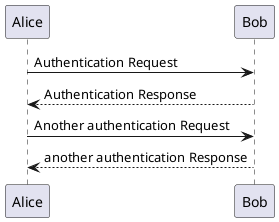

# Začni

To je Dokumentacija Košarice.

## Izvoz dokumentacije v PDF

Tukaj je izvožena dokumentacija v PDF: <a href="readme.pdf">readme.pdf</a>.

## Zanimive povezave:

1. **Primerjava popularnosti** nekaterih orodij za dokumentiranje: 
  https://www.npmtrends.com/docsify-vs-vuepress-vs-redoc-vs-swagger-ui
2. **apiDoc** - **dokumentiranje v kodi** za generiranje zanimive drevesne API dokumentacije **s prmerjavo verzij**:
  https://apidocjs.com/ + primer: https://apidocjs.com/example/
  - Alternativa 1 za diff (Java objekt, HTML & MD renderer): https://github.com/quen2404/openapi-diff
  - Alternativa 2 za diff (JSON z označenimi breaking changes): https://bitbucket.org/atlassian/openapi-diff/
3. **API Builder** - **contract first** API dizajn, implementacija, dokumentiranje in generiranje klientov (npr. tudi Java in Swagger):
  https://app.apibuilder.io/doc/why + primer: https://app.apibuilder.io/apicollective/apibuilder-api/latest
4. **widdershins** - generiranje **MD falov iz OpenAPI** (npr. za potrebe alternative Swagger UI v navezavi z npr. [Slate](https://github.com/slatedocs/slate)) s podporo **primerov kode klientov** v različnih jezikih:
  https://github.com/mermade/widdershins + [primer](https://camo.githubusercontent.com/6ca9fd1cc1da120cf33028722625c3941b43a03b/68747470733a2f2f6d65726d6164652e6769746875622e696f2f7769646465727368696e732f73637265656e73686f742e706e67)
5. **Zelo obširen seznam OpenAPI orodij** (za v2 in v3 - vedno označeno, katere podpira):
  https://openapi.tools/
6. **Še en obširen seznam OpenAPI orodij** (po kategorijah ali jezikih za v2 in v3 - v opisu navedeno, katere podpira):
  https://apis.guru/awesome-openapi3/
7. Orodje za izločanje (internih oz. drugih kategorijah) path-ov iz OpenAPI datoteke (`x-internal: true` ali custom razširitve):
  https://github.com/Mermade/openapi-filter

## Zavihki

<!-- tabs:start -->

#### ** Java **

... java ...

#### ** JavaScript **

... javascript ...

#### ** cURL **

... cURL ...

<!-- tabs:end -->

## PlantUML

## Alerti

> [!NOTE]
> To je opomba.

> [!TIP]
> To je namig.

> [!WARNING]
> To je opozorilo.

> [!DANGER]
> To je posebej pomembno opozorilo.

> [!COMMENT]
> To je komentar (vsebovan v custom alertu).

## Prosto dostopne ikone

:fas fa-home:
:fas fa-camera:
:fas fa-clipboard-check:
:fas fa-clipboard-list:
:fas fa-comments:
...
[Ostale ikone](https://fontawesome.com/icons?d=gallery&s=solid&m=free)
 
 
:fas fa-calendar-alt:
<i class="fas fa-calendar-alt" style="font-size:30px; color:red"></i>
<i class="fas fa-calendar-alt" style="font-size:60px; color:blue"></i>
<i class="fas fa-calendar-alt" style="font-size:90px; color:orange"></i>
<i class="fas fa-calendar-alt" style="font-size:120px; color:green"></i>
